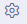

<!--
    This source file is part of the open source project
    ExpressionEngine User Guide (https://github.com/ExpressionEngine/ExpressionEngine-User-Guide)

    @link      https://expressionengine.com/
    @copyright Copyright (c) 2003-2020, Packet Tide, LLC (https://packettide.com)
    @license   https://expressionengine.com/license Licensed under Apache License, Version 2.0
-->

# Add-Ons

[TOC]

## Overview
Add-ons can extend the functionality of ExpressionEngine, adding more features, fields, template tags, and more!

There are three main sources of add-ons for ExpressionEngine:

- Add-ons that are shipped with ExpressionEngine (found in the `Add-ons` section of the Control Panel)
- Add-ons that are downloaded from an outside resource such as the [ExpressionEngine Add-on Store](https://expressionengine.com/add-ons) or other developers.
- Add-ons that you create yourself (see [Add-on Development](/development/addon-development-structure.md) for more information on creating your own add-ons).

Add-ons that are not shipped with ExpressionEngine or created by the ExpressionEngine team are typically referred to as "third-party add-ons."

TIP: Visit the [Add-on Store](https://expressionengine.com/add-ons) to browse available add-ons.

## Installing Add-ons

Installing an add-on is easy!

1. Download the add-on and unzip its contents.
2. Upload the add-on's folder to your `/system/user/addons/` folder. If needed, also copy any themes to you `/themes/user/` folder.
3. Once the add-on is uploaded, you should see it listed in the [Add-on Manager](control-panel/addons-manager.md) in your ExpressionEngine Control Panel. You can then click install!

NOTE: Some add-ons include a `themes` folder. This folder includes supporting styles and scripts to help the add-on function properly. Add-on themes should be copied to the `themes/user/` folder.

## Updating Add-ons

Updating an installed add-on is just as easy as installing.

1. Download the add-on and unzip its contents.
2. Overwrite any older versions of the add-on that may be in place by upload the add-on's folder to your `/system/user/addons/` folder. If needed, also copy and overwrite any themes to you `/themes/user/` folder. 
3. Once the add-on is uploaded, you will see it listed in the "Updates" tab of the [Add-on Manager](control-panel/addons-manager.md) in your ExpressionEngine Control Panel. You can then click the Update button to update your add-on to its newest version!

TIP: Some add-ons may notify you in the Add-on Manager that there is an upload available for download. Others you will have to check with the add-on vendor to determine if a newer version is available. 

## Uninstalling Add-ons

Follow these steps to ensure an installed add-on is properly removed from your site.

1. In the Add-on Manager, select the gear icon (  ) next to your add-on.
2. Select Uninstall from the flyout menu options.
3. Follow the prompts to uninstall your add-on.

After you have uninstalled your add-on, you may then delete it's folder from your filesystem if you no longer need it. 

