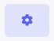
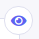

<!--
    This source file is part of the open source project
    ExpressionEngine User Guide (https://github.com/ExpressionEngine/ExpressionEngine-User-Guide)

    @link      https://expressionengine.com/
    @copyright Copyright (c) 2003-2021, Packet Tide, LLC (https://packettide.com)
    @license   https://expressionengine.com/license Licensed under Apache License, Version 2.0
-->

# Dashboard Management

Each member can show, hide, or rearrange [Dashboard Widgets](pro/development/widgets.md) to customize their own Control Panel homepage. 

To manage what is being shown:

- Click the gear icon in top right corner of homepage (  ). 
- Hide or unhide and change widgets using the visibility icon in the top right of each widget (  ).
- Rearrange widget using the grab handle in the top left of each widget (  ). Simply grab the handle and drag the widget to a new position. Note that widget widths are declared in the code for the widget. Widget widths cannot be changed from the Dashboard edit view.

Dashboard layouts are saved on per-member basis.

