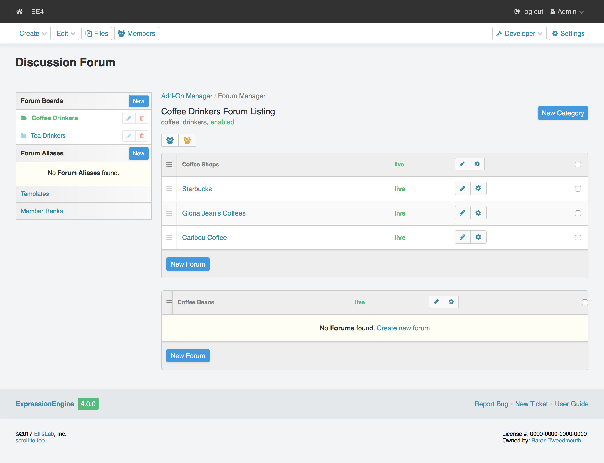

Forum Boards
============

Overview
--------

The Discussion Forum module allows you to create multiple forum "boards"
enabling you to run separate forums on one installation. Each board can
have its own URL, making it possible for you to have separate boards for
each site, or even run multiple distinct boards on a single site.

Managing Boards
---------------

The "Forum Boards" are displayed in the left navigation.  From there you can add new boards and edit or delete existing ones.

|Forum Boards|

Forum Board Management
~~~~~~~~~~~~~~~~~~~~~~

|Forum Board Management|

General Settings
~~~~~~~~~~~~~~~~~~~~~~

Enable Board
^^^^^^^^^^^^

Yes / No. Whether or not the forum board is turned on.

Name
^^^^

Full descriptive name of this board.

Short Name
^^^^^^^^^^

The "short name" for the forum board, used in the board= parameter of
the Forum tag when running forums through regular templates.

Forum Directory
^^^^^^^^^^^^^^^

URL to the forum.

Forum URL segment
^^^^^^^^^^^^^^^^^

Word that triggers forum display. Cannot be the same as a template or template group.

PHP Settings
~~~~~~~~~~~~

Allow PHP
^^^^^^^^^

Allows the use of standard PHP within forum templates.

PHP parsing stage
^^^^^^^^^^^^^^^^^
When set to output, PHP will be parsed after the template.

Attachment Settings
~~~~~~~~~~~~~~~~~~~

Attachments per post
^^^^^^^^^^^^^^^^^^^^
Maximum attachments allowed per post.

Upload directory
^^^^^^^^^^^^^^^^
URL to the upload directory.

Allowed file types
^^^^^^^^^^^^^^^^^^
You may specify any allowed file type or images only.

File size
^^^^^^^^^
Maximum file size in megabytes.

Image width
^^^^^^^^^^^
Maximum image width in pixels

Image height
^^^^^^^^^^^^
Maximum image height in pixels.

Enable thumbnail creation
^^^^^^^^^^^^^^^^^^^^^^^^^

When set to enable, clickable thumbnails will be shown in posts.

Thumbnail width
^^^^^^^^^^^^^^^

Maximum thumbnail width in pixels.

Thumbnail height
^^^^^^^^^^^^^^^^

Maximum thumbnail height in pixels.

.. |Forum Board Management| image:: ../../images/forum_board_management.png
