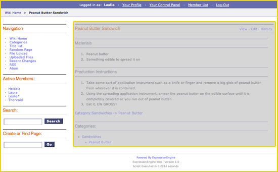

Wiki Page Section
=================

.. contents::
	:local:
	:depth: 1

This is the **wrapper** section that contains the header, sidebar,
navigation, CSS, and the elements found in a standard HTML page
including the CSS. It "wraps" around all the user editable content as
outlined in the screencap below.

|The Wiki Page section controls the highlighted area|

The variables available to the Wiki Page section are divided into the
following broad categories:

Single Variables
----------------

.. contents::
	:local:

elapsed\_time
~~~~~~~~~~~~~

::

	{elapsed_time}

Time to render page

original\_page
~~~~~~~~~~~~~~

::

	{original_page}

If a page is redirected, this tag displays the name of the original
page. This variable is used inside the `if redirected`_ conditional.

redirect\_page
~~~~~~~~~~~~~~

::

	{redirect_page}

If a page redirects this variable sets the page to which it redirects.
The value is set dynamically by ExpressionEngine. This variable is used
inside the `if redirected`_ conditional.

revision\_id
~~~~~~~~~~~~

::

	{revision_id}

If you are viewing a revision of an article, this variable displays the
the revision id for that revision.

title
~~~~~

::

	{title}

Displays the Title/Name of the article page. This variable also works
with **Special** and **File** template sections too).

wiki\_name
~~~~~~~~~~

::

	{wiki_name}

Displays the Wiki's Full Name (see the :doc:`Wiki Control
Panel <wiki_cp>`).

csrf\_token
~~~~~~~~~~~

::

	{csrf_token}

This variable is a required value for hidden form field 'csrf\_token'.

.. note:: This variable was previously called as ``{XID_HASH}`` and used
  in a field named 'XID'.

Namespace Variables
-------------------

namespace
~~~~~~~~~

::

	{namespace}

The current namespace being viewed on the page.

category\_namespace
~~~~~~~~~~~~~~~~~~~

::

	{category_namespace}

The name of the 'Category' namespace.

file\_namespace
~~~~~~~~~~~~~~~

::

	{file_namespace}

The name of the 'File' namespace.

image\_namespace
~~~~~~~~~~~~~~~~

::

	{image_namespace}

The name of the 'Image' namespace.

main\_namespace
~~~~~~~~~~~~~~~

::

	{main_namespace}

The name of the 'Main' default namespace, which is where all articles
without a namespace in their title are put.

special\_namespace
~~~~~~~~~~~~~~~~~~

::

	{special_namespace}

The name of the 'Special' namespace.

Path Variables
--------------

path:wiki\_base\_url
~~~~~~~~~~~~~~~~~~~~

::

	{path:wiki_base_url}

This variable will generate the base URL for the wiki, with a trailing
slash. This is useful for linking to special pages like **Categories**,
**Title list**, etc... For example, this::

	<a href="{path:wiki_base_url}{special_namespace}:Titles">Title List</a>

Would be rendered like this::

	<a href="http://example.com/index.php/wiki/Special:Titles">Title List</a>

path:wiki\_home
~~~~~~~~~~~~~~~

::

	{path:wiki_home}

This variable will generate the URL for the wiki's homepage which is set
in the :doc:`Wiki Control Panel <wiki_cp>`. For example, this::

	<a href="{path:wiki_home}">Home</a>

Would be rendered like this::

	<a href="http://example.com/index.php/wiki">Home</a>

path:view\_article
~~~~~~~~~~~~~~~~~~

::

	{path:view_article}

When viewing an article page this variable displays the URL to view the
article. Think of it as the article's "permalink".

path:edit\_topic
~~~~~~~~~~~~~~~~

::

	{path:edit_topic}

When viewing an article page this variable displays the URL to edit the
article.

path:article\_history
~~~~~~~~~~~~~~~~~~~~~

::

	{path:topic_history}

When viewing an article page this variable displays the URL to an
article's history.

Member Variables
----------------

if logged\_out
~~~~~~~~~~~~~~

::

	{if logged_out}

This conditional checks to see if the user IS **NOT** logged in.

if logged\_in
~~~~~~~~~~~~~

::

	{if logged_in}

This conditional checks to see if the user **IS** logged in.

screen\_name
~~~~~~~~~~~~

::

	{screen_name}

Displays the Screen Name for logged in user.

path:login
~~~~~~~~~~

::

	{path:login}

Displays the URL to the Login page.

path:register
~~~~~~~~~~~~~

::

	{path:register}

Displays the URL to the Register page.

path:memberlist
~~~~~~~~~~~~~~~

::

	{path:memberlist}

Displays the URL to the Member List page.

path:your\_profile
~~~~~~~~~~~~~~~~~~

::

	{path:your_profile}

Displays the URL to the Profile page of the logged in user.

path:your\_control\_panel
~~~~~~~~~~~~~~~~~~~~~~~~~

::

	{path:your_control_panel}

Displays the URL to the Your Control Page of the logged in user.

path:logout
~~~~~~~~~~~

::

	{path:logout}

Displays the URL to the logout script.

**Note to Discussion Forum Module users:** The :ref:`wiki_tag` has an optional
parameter called **profile\_path=''**. When this parameter is used, you can direct the
member paths from the default member area of your ExpressionEngine
installation to the Discussion Forum member area.

Conditional Variables
---------------------

The best way to understand how these conditionals are used is to look at
the code in the themes/wiki\_themes/default/default.php file. Do a
search for the conditional you are reviewing and see how it is used in
the template.

if new\_article
~~~~~~~~~~~~~~~

::

	{if new_article}

Checks to see if current page is a new article.

if article
~~~~~~~~~~

::

	{if article}

Checks to see if the current page is an article.

if redirected
~~~~~~~~~~~~~

::

	{if redirected}

Checks to see if the current page has been redirected from another page.

if redirect\_page
~~~~~~~~~~~~~~~~~

::

	{if redirect_page}

Checks if the current page should redirect to another page.

if revision
~~~~~~~~~~~

::

	{if revision}

Checks to see if the current page is a revision of an article.

if edit\_article
~~~~~~~~~~~~~~~~

::

	{if edit_article}

Checks to see if the current page is the article's Editing page.

if article\_history
~~~~~~~~~~~~~~~~~~~

::

	{if article_history}

Checks to see if the current page is the article's History page.

if special\_page
~~~~~~~~~~~~~~~~

::

	{if special_page}

Checks to see if the current page is a **Special page** (Categories,
Title list, etc...) in the wiki.

if file\_page
~~~~~~~~~~~~~

::

	{if file_page}

Checks to see if the current page is the special File page in the wiki.

if can\_edit
~~~~~~~~~~~~

::

	{if can_edit}

Checks to see if the current visitor to the page is logged in and has
permission to edit the article.

if cannot\_edit
~~~~~~~~~~~~~~~

::

	{if cannot_edit}

Checks to see if the current visitor to the page is logged in and does
not have permission to edit the article.

if can\_admin
~~~~~~~~~~~~~

::

	{if can_admin}

Checks to see if the logged in user is a wiki administrator.

if cannot\_admin
~~~~~~~~~~~~~~~~

::

	{if cannot_admin}

Checks to see if the current user is not a wiki admin.

if uploads
~~~~~~~~~~

::

	{if uploads}

Checks to see if the wiki allows uploads and if the upload info is
valid.

{wiki:categories\_list}
-----------------------

This tag is used to display all the wiki's categories. Unlike the
:ref:`{wiki:categories} <wiki_categories_tag>`
tag, it is not affected by being put in an article page. It has the
following parameters and variables available to it.

{wiki:categories\_list} \| Parameters
~~~~~~~~~~~~~~~~~~~~~~~~~~~~~~~~~~~~~

backspace=""
^^^^^^^^^^^^

::

	{wiki:categories backspace="#"}

This removes "#" number of characters (including spaces and line breaks)
from the output at the end of the loop. This is useful for removing
commas and  's.

show\_empty=""
^^^^^^^^^^^^^^

::

	{wiki:categories show_empty="no"

This parameter lets you tell the wiki whether or not to display
categories with no articles assigned to it. The possible values are:

-  **no**: Categories with no articles will not be displayed.

style=""
^^^^^^^^

::

	{wiki:categories style=""}

This will automatically nest the categories for you as standard xhtml
using <ul> or render a list without any formatting. The values are:

-  **nested**: renders the categories in a xhtml list with <ul>.
-  **linear**: renders the categories with no formatting.

For more information on nesting please see the :ref:`Style parameter
<channel_categories_style>` in the Channel section of the User Guide.

{wiki:categories\_list} \| Variables
~~~~~~~~~~~~~~~~~~~~~~~~~~~~~~~~~~~~

{wiki:categories\_list} \| Single Variables
^^^^^^^^^^^^^^^^^^^^^^^^^^^^^^^^^^^^^^^^^^^

path:view\_category
'''''''''''''''''''

::

	{path:view_category}

Creates a link to view a specific category page.

category\_name
''''''''''''''

Displays the category name.

depth
'''''

::

	{depth}

Determines how many nested layers down a category is.

{wiki:categories\_list} \| Conditional Variables
^^^^^^^^^^^^^^^^^^^^^^^^^^^^^^^^^^^^^^^^^^^^^^^^

if depth
''''''''

::

	{if depth == '#'}

You can check to see if a category is at a certain "depth" in the list.

if children
'''''''''''

::

	{if children}

Determines if a category has one or more "children" categories.

if first\_child
'''''''''''''''

::

	{if first_child}

Determines if a category is the first child of a parent category.

if last\_child
''''''''''''''

::

	{if last_child}

Determines if a category is the last child of a parent category.

