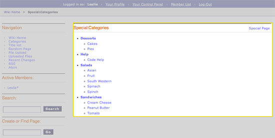

Wiki Special Categories Template
================================

The Special Categories template creates a list of all the categories in
a site as outlined below:

|Displays all the categories in the wiki.|

In addition to the variables in the :doc:`Wiki Page
template <wiki_templates_page>`, the Special Categories template
makes use of the the following **Tags**:

.. _wiki_categories_tag:

{wiki:categories}
-----------------

This tag is used to display all the wiki's categories. When put into the
:doc:`Wiki Article </addons/wiki/wiki_templates_article>` template, it will only
show the categories for that specific article. It has
:ref:`Parameters <wiki_categories_parameters>` and
:ref:`Variables <wiki_categories_variables>` available to it.

.. _wiki_categories_parameters:

{wiki:categories} \| Parameters
~~~~~~~~~~~~~~~~~~~~~~~~~~~~~~~

backspace=""
^^^^^^^^^^^^

::

	{wiki:categories backspace="#"}

This removes "#" number of characters from the output at the end of the
loop. This is useful for removing commas and  's.

show\_empty=""
^^^^^^^^^^^^^^

::

	{wiki:categories show_empty="no"

This parameter lets you tell the wiki whether or not to display
categories with no articles assigned to it. The possible values are:

-  **no**: Categories with no articles will not be displayed.

style=""
^^^^^^^^

::

	{wiki:categories style=""}

This will automatically nest the categories for you as standard xhtml
using <ul> or render a list without any formatting. The values are:

-  **nested**: renders the categories in a xhtml list with <ul>.
-  **linear**: renders the categories with no formatting.

For more information on nesting please see the :ref:`Style parameter
<channel_categories_style>` in the Channel section of the User Guide.

.. _wiki_categories_variables:

{wiki:categories} \| Variables
~~~~~~~~~~~~~~~~~~~~~~~~~~~~~~

{wiki:categories} \| Single Variables
^^^^^^^^^^^^^^^^^^^^^^^^^^^^^^^^^^^^^

path:view\_category
'''''''''''''''''''

::

	{path:view_category}

Creates a link to view a specific category page.

category\_name
''''''''''''''

Displays the category name.

count
'''''

::

	{count}

"count" of the category currently being displayed in the list

depth
'''''

::

	{depth}

Determines how many nested layers down a category is.

switch=
'''''''

::

	{switch="option_one|option_two|option_three"}

This variable permits you to rotate through any number of values as the
categories are displayed. The first category will use "option\_one", the
second will use "option\_two", the third "option\_three", the fourth
"option\_one", and so on.

Multiple instances of the {switch=} tag may be used and the system will
intelligently keep track of each one.

{wiki:categories} \| Conditional Variables
^^^^^^^^^^^^^^^^^^^^^^^^^^^^^^^^^^^^^^^^^^

if depth
''''''''

::

	{if depth == '#'}

You can check to see if a category is at a certain "depth" in the list.

if children
'''''''''''

::

	{if children}

Determines if a category has one or more "children" categories.

if first\_child
'''''''''''''''

::

	{if first_child}

Determines if a category is the first child of a parent category.

if last\_child
''''''''''''''

::

	{if last_child}

Determines if a category is the last child of a parent category.

.. _wiki_category_subcategories:

{wiki:category\_subcategories}
------------------------------

This tag is used to display the subcategories of a single category. It
has :ref:`Parameters <wiki_category_subcategories_parameters>` and
:ref:`Variables <wiki_category_subcategories_variables>` available to it.

.. _wiki_category_subcategories_parameters:

{wiki:category\_subcategories} \| Parameters
~~~~~~~~~~~~~~~~~~~~~~~~~~~~~~~~~~~~~~~~~~~~

backspace
^^^^^^^^^

::

	{wiki:category_subcategories backspace="#"}

This removes "#" number of characters from the output at the end of the
loop. This is useful for removing commas and  's.

style
^^^^^

::

	{wiki:category_subcategories style=""}

This will automatically nest the subcategories for you as standard xhtml
using <ul> or render a list without any formatting. The values are:

-  **nested**: renders the categories in a xhtml list with <ul>.
-  **linear**: renders the categories with no formatting.

For more information on nesting please see the :ref:`Style parameter
<channel_categories_style>` in the Channel section of the User Guide.

.. _wiki_category_subcategories_variables:

{wiki:category\_subcategories} \| Variables
~~~~~~~~~~~~~~~~~~~~~~~~~~~~~~~~~~~~~~~~~~~

Pair Variables
^^^^^^^^^^^^^^

header
''''''

::

	{header} content before listing subcategories. {/header}

This variable will display content before the subcategories are listed.

footer
''''''

::

	{footer} content after listing subcategories. {/footer}

This variable will display content after the subcategories are listed.

Conditional Variables
^^^^^^^^^^^^^^^^^^^^^

if subcategory\_total
'''''''''''''''''''''

::

	{if subcategory_total == '0'}

Test the number of subcategories. This is typically used display
alternate content if no subcategories exist.

Single Variables
^^^^^^^^^^^^^^^^

path:view\_category}
''''''''''''''''''''

::

	{path:view_category}

This creates a link to view a category's page (a list of all the titles
in that category).

category\_name
''''''''''''''

::

	{category_name}

Displays a category's name.

subcategory\_total
''''''''''''''''''

::

	{subcategory_total}

Displays the number of subcategories in a category.

.. _wiki_category_articles:

{wiki:category\_articles}
-------------------------

This tag displays a list of articles within a category. It has
`Parameters <#cat_art_para>`_ and `Variables <#cat_art_var>`_ available
to it.

{wiki:category\_articles} \| Parameters
~~~~~~~~~~~~~~~~~~~~~~~~~~~~~~~~~~~~~~~

backspace=""
^^^^^^^^^^^^

::

	{wiki:category_articles backspace="#"}

This removes "#" number of characters from the output at the end of the
loop. This is useful for removing commas and  's.

limit
^^^^^

::

	{wiki:category_articles limit=""}

This determines how many articles are displayed on a category's page.
For example, this::

	{wiki:category_articles limit="20"}

Would limit the number of articles displayed to 20.

paginate
^^^^^^^^

::

	{wiki:category_articles paginate=""}

This determines the placement of pagination. For example, if the
`limit <#catart_para_limit>`_ parameter is set to 20 and there are 55
articles, then you can use this parameter to create pagination to browse
all the articles.

The values for the paginate parameter are:

-  **top**: pagination is placed on top.
-  **bottom**: pagination is placed on the bottom.
-  **both**: pagination is placed on the top and the bottom.

{wiki:category\_articles} \| Variables
~~~~~~~~~~~~~~~~~~~~~~~~~~~~~~~~~~~~~~

`Pair Variables <#catart_pair>`_
`Conditional Variables <#catart_con>`_
`Single Variables <#catart_sin>`_

Pair Variables
^^^^^^^^^^^^^^

header
''''''

::

	{header} content before listing articles. {/header}

This variable will display content before the articles are listed.

footer
''''''

::

	{footer} content after listing articles. {/footer}

This variable will display content after the articles are listed.

letter\_header
''''''''''''''

::

	{letter_header}
{letter}
{/letter_header}

This is used to organize articles by the first letter of the title. It
looks at the first character of each article and when there is a new
character it will create a header for that letter using the **{letter}**
variable as in the example above.

Conditional Variables
^^^^^^^^^^^^^^^^^^^^^

if articles\_total
''''''''''''''''''

::

	{if articles_total == '0'}

Test the number of articles. This is typically used to display alternate
content if no articles exist for a particular category.

Single Variables
^^^^^^^^^^^^^^^^

path:view\_category}
''''''''''''''''''''

::

	{path:view_category}

This creates a link to view a category's page (a list of all the titles
in that category).

category\_name
''''''''''''''

::

	{category_name}

Displays a category's name.

articles\_total
'''''''''''''''

::

	{articles_total}

Displays the number of articles in a category.

