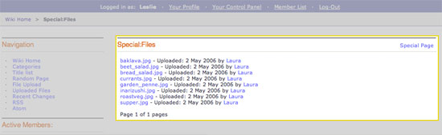

Wiki Special Files Template
===========================

This template displays all the wiki's upload files as outlined below:

|Displays all the wiki's upload files.|

In addition to the variables in the :doc:`Wiki Page
template <wiki_templates_page>`, the Special Files template has:

Tags
----

The Wiki Special Files template has the **{wiki:files}** tag available
which is used to display a list of all the files that have been uploaded
to the wiki. This tag has `Parameters <#para>`_ and `Variables <#vars>`_
available to it.

{wiki:files} \| Parameters
~~~~~~~~~~~~~~~~~~~~~~~~~~

limit
^^^^^

::

	{wiki:files limit="#"}

This determines the number of files to display on a page. For example,
this: ``{wiki:files limit="10"}``

Would limit the number of files displayed to 10.

paginate
^^^^^^^^

::

	{wiki:files paginate=""}

The Wiki module uses the same pagination syntax as all first-party
modules. Please look at the :doc:`/templates/pagination` documentation
for more information.

orderby
^^^^^^^

::

	{wiki:files orderby="file_name"}

This determines the field that is used to order the files. "file\_name"
is the default behavior. ::

	{wiki:files orderby="file_size"}

Would list the files in order of file size.

sort
^^^^

::

	{wiki:files sort="asc"}

The sort order can be ascending or descending. The default is "asc",
ascending. ::

	{wiki:files orderby="upload_date" sort="desc"}

Would list the files in order of the date uploaded, from most recent to
oldest.

{wiki:files} Variables
~~~~~~~~~~~~~~~~~~~~~~

Single Variables
^^^^^^^^^^^^^^^^

absolute\_count
'''''''''''''''

::

	{absolute_count}

Running "count" of the displayed file, taking pagination into
consideration.

author
''''''

::

	{author}

Displays the Screen Name of the person who uploaded the file.

count
'''''

::

	{count}

"count" of the file currently being displayed

email
'''''

::

	{email}

This displays the email address of the person who uploaded the file.

file\_name
''''''''''

::

	{file_name}

Displays the file's File name.

file\_type
''''''''''

::

	{file_type}

Displays the file's MIME Type.

path:author\_profile
''''''''''''''''''''

::

	{path:author_profile}

Displays the path to the member profile of the person who uploaded the
file.

path:view\_file
'''''''''''''''

::

	{path:view_file}

Displays the URL to view a file's page. This is not the raw path to the
file.

summary
'''''''

::

	{summary}

Displays the file's summary.

switch=
'''''''

::

	{switch="option_one|option_two|option_three"}

This variable permits you to rotate through any number of values as the
files are displayed. The first file will use "option\_one", the second
will use "option\_two", the third "option\_three", the fourth
"option\_one", and so on.

Multiple instances of the {switch=} tag may be used and the system will
intelligently keep track of each one.

upload date
'''''''''''

::

	{upload_date format=""}

Displays the date the file was uploaded.

The **format** parameter is used to determine the date's formatting
using ExpressionEngine's :doc:`Date Variable Formatting
</templates/date_variable_formatting>`.

url
'''

::

	{url}

This displays the author's URL.

Conditional Variables
^^^^^^^^^^^^^^^^^^^^^

if is\_image
''''''''''''

::

	{if is_image}

Checks to see if the uploaded file is an image. If yes, then do
something.

