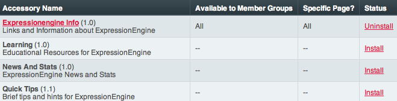
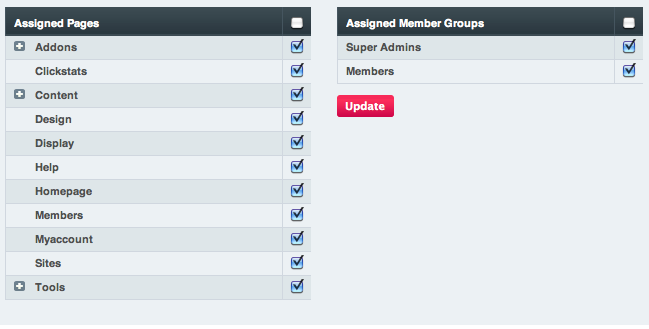

Accessories Manager
===================

.. rst-class:: cp-path

**Control Panel Location:** :menuselection:`Add-ons --> Accessories`

The Accessories Manager page of the Control Panel allows you to install
and manage access to Accessories. Accessories populate tabs in the
control panel, allowing you to display additional information to users.
Virtually anything can be displayed in an Accessory tab, including
video, data pulled from the database, or information from off-site. The
Accessories manager allows you to determine where in the control panel a
given tab appears as well as limit the view (and access) by member
group.

|Addons Accessories|

Installing Accessories
----------------------

The Accessories Manager will not download and install accessories for
you. In order to install an accessory you must first place the accessory
file in your /system/expressionengine/third\_party/accessories/ folder
and then when you reload the Accessories Manager the accessory will
automatically be available for you to install.

.. note:: Some accessories will have language files, so put these files
	in your third party language folder in the
	``/system/expressionengine/third_party/language/`` directory.

Accessory Preferences
---------------------

When you first install an Accessory, it defaults to displaying on all
control panel pages to all member groups. You can edit these display
preferences by clicking the Accessory's name. The Accessory preferences
page allows you to specify which pages the accessory tab will be
displayed on. In addition, you can limit the view to specific member
groups.

|Addons Manage Accessories|

