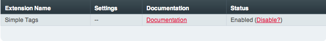

Extensions Manager
==================

.. rst-class:: cp-path

**Control Panel Location:** :menuselection:`Add-ons --> Extensions`

The Extensions Manager page of the Control Panel allows you to install
and manage Extensions, which are small scripts that expand the core
functionality of ExpressionEngine without hacking any of the
ExpressionEngine files.

|Extensions Manager|

As Extensions are calling code within the ExpressionEngine code there is
a chance that an extension will interfere with how your site is working.
If you are unsure of which extension might be causing a problem you can
either turn them off one by one until the problem disappears or simply
click the **Disable Extensions?** button at the top right and turn off
all extensions at once. The latter option allows a quick fix and gives
you the option of solving the problem at your leisure, perhaps when the
site is less busy.

Installing Extensions
---------------------

The Extensions Manager will not download and install extensions for you.
In order to install an extension you must first place the extension
package in your /system/expressionengine/third\_party/ folder and then
when you reload the Extensions Manager the extension will automatically
be available for you to enable.

.. note:: Extensions might require other tasks to function correct, so
	make sure to follow any instructions included with the extension.

Settings
--------

The developer of an extension might allow an administrator of a site to
specify certain settings so the administrator can choose how the
extension interacts with the site. If such settings are available, a
**Settings** link will appear in the row for the extension and when you
click a form will appear allowing you to fill out information. Once
saved the settings will automatically take effect.

Upgrading Extensions
--------------------

If a new version of an extension used by your site becomes available,
simply download the new version and upload the package to your
/system/expressionengine/third\_party/ folder where it will overwrite
the old version. The extension will automatically be updated by
ExpressionEngine with no further work done by you. Make sure to update
any language files as well.

