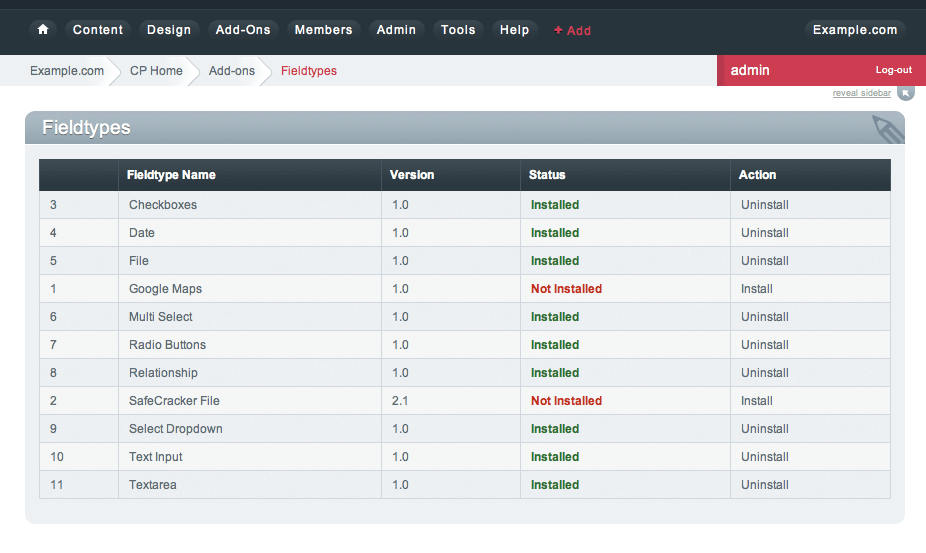

Fieldtype Manager
=================

.. rst-class:: cp-path

**Control Panel Location:** :menuselection:`Add-ons --> Fieldtypes`

Fieldtypes handle all of the different types of data you can store in your Channels.
ExpressionEngine includes a number of Fieldtypes by default, and you can install
or uninstall additional ones from this page.

|Fieldtype Manager|

