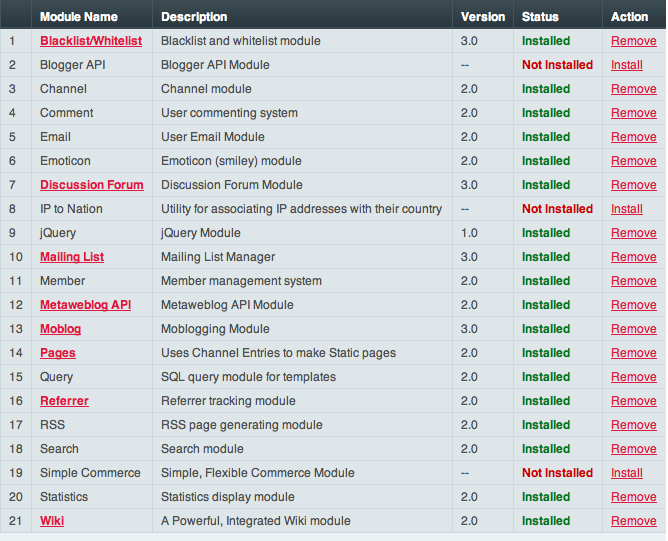

Modules Manager
===============

.. rst-class:: cp-path

**Control Panel Location:** :menuselection:`Add-ons --> Modules`

|Modules|

Modules provide the Tags that you can use in your :doc:`Templates </templates/index>`.
ExpressionEngine includes a number of :doc:`Modules </add-ons/index>` by default,
and you can install or uninstall additional ones from this page.

Some Modules include their own Control Panel, enabling you to perform
certain actions specific to that Module. For example, in the Mailing
List Module Control Panel you can view, edit, and delete subscribed
email addresses. You can access the control panel for each module that
has one by clicking the name of the module in the Modules page.

To trigger updates for modules with updated packages, click the "Run
Module Updates" button above the module listing, or if the module has
its own control panel, visiting that module's control panel will also
trigger an update for that module.

