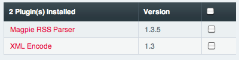

Plugin Manager
==============

.. rst-class:: cp-path

**Control Panel Location:** :menuselection:`Add-ons --> Plugins`

The Plugin Manager page of the Control Panel allows you to view
information about your installed plugins.

|Plugin Manager|

Currently Installed Plugins
~~~~~~~~~~~~~~~~~~~~~~~~~~~

This table lists all of your installed plugins, their installed version,
and a short description. Clicking on a plugin name leads to a subpage
with additional information about the selected plugin.

This section will also allow you to remove installed plugins. To do so,
select the plugin or plugins with the checkboxes on the right and then
use the Remove button at the bottom. You will receive a confirmation
page to make sure you really want to remove the selected plugins. There
is **no undo** feature here, so once a plugin is removed it is gone. You
can, of course, reinstall it.

Installing Plugins
------------------

To install plugins follow the detailed instructions in `Using
Plugins <../../templates/plugins.html>`_.

