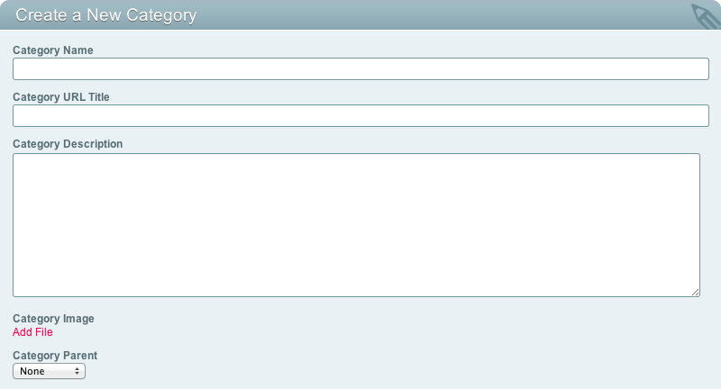

Create a New Category
=====================

.. rst-class:: cp-path

**Control Panel Location:** :menuselection:`Admin --> Channel Administration --> Categories --> Create a New Category`

|Create a New Category|

Category Name
~~~~~~~~~~~~~

The name of the new category. The name may include spaces.

Category URL Title
~~~~~~~~~~~~~~~~~~

The human readable category name used in the URL when using `Category
URL Titles in Links <global_channel_preferences.html>`_.

Category Description
~~~~~~~~~~~~~~~~~~~~

A text description of your category.

Category Image URL
~~~~~~~~~~~~~~~~~~

This field is designed to allow you to associate an image with the
category within your `Channel
Entries <../../../modules/channel/channel_entries.html>`_ Tag. It is
also possible to use this field to store other types of text, but a URL
is the most common choice.

Category Parent
~~~~~~~~~~~~~~~

This drop-down list allows you to create a hierarchical relationship
between categories. The list dynamically contains all existing
categories for this category group. Selecting a parent category means
that the new category will be a "child" of the parent in the hierarchy.
The "None" option is available and will make the new category a "top
level" category with no parent.

