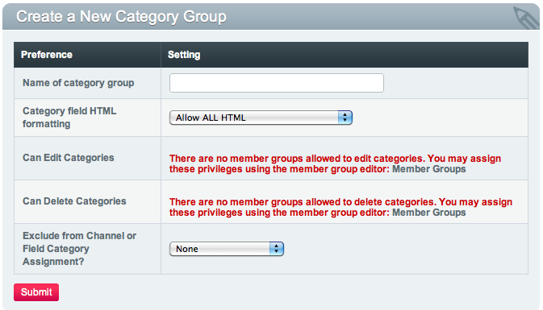

Create a New Category Group
===========================

.. rst-class:: cp-path

**Control Panel Location:** :menuselection:`Admin --> Channel Administration --> Categories --> Create a New Category Group`

This page permits you to create a new category group. The name must be
unique, but spaces are allowed.

|Create a New Category Group|

Name of category group
----------------------

The name of the category group, used throughout the control panel.

Category field HTML formatting
------------------------------

This setting determines how raw HTML code within custom category fields
is handled. There are three options:

#. **Convert HTML into character entities**: This will convert the HTML
   tags so that they will display as plain text on a page when viewed.
   This would be useful if you want to display example code often.
#. **Allow only safe HTML**: This will allow "safe" HTML (<b>, <i>, <u>,
   <em>, <strike>, <strong>, <pre>, <code>, <blockquote>, <h2>, <h3>,
   <h4>, <h5>, <h6>) to be kept so that they are interpreted by the
   browser when the entry is viewed. All other HTML is converted to
   character entities and the raw code will be seen upon viewing.
#. **Allow ALL HTML**: This leaves the HTML code as written and the code
   will then be interpreted by the browser when the entry is viewed.

Can Edit Categories
-------------------

Member groups who have "Can Edit Categories" privileges will be
displayed in this list. You can select or deselect from these member
groups to selectively allow or disallow access to editing categories
within this group.

Can Delete Categories
---------------------

Member groups who have "Can Delete Categories" privileges will be
displayed in this list. You can select or deselect from these member
groups to selectively allow or disallow access to deleting categories
within this group.

Exclude from Channel or Field Category Assignment
-------------------------------------------------

If you choose an option from this drop down list, you can pick one item
to to keep a particular member group from being able to assign channel
or upload preferences.

