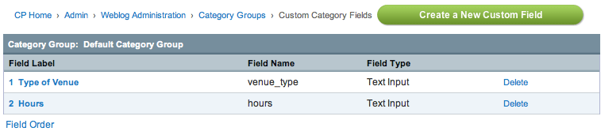

Category Field Management
=========================

.. rst-class:: cp-path

**Control Panel Location:** :menuselection:`Admin --> Channel Administration --> Categories --> Manage Category Fields`

|Category Field Manager|

This section of the Control Panel is for the management of category
custom fields. It is where category fields are created, deleted, and
preferences are set.

The main Category Field Management screen shows a table of all the
existing category fields for the currently chosen category group. It
lists the category field name and provides links to edit the
preferences.

-  :doc:`Create a New Category Field <category_fields_edit>`: Enables you
   to Create a new Category Field.
-  :doc:`Edit Field <category_fields_edit>`: Click the Field Label to
   edit the category field.
-  **Delete**: Delete the category field and associated data.

