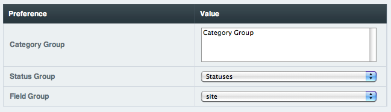

Edit Group Assignments
======================

.. rst-class:: cp-path

**Control Panel Location:** :menuselection:`Admin --> Channel Administration --> Channels`

This screen allows you to edit the groups associated with the channel.

|Channel Group Prefs|

Category Group
~~~~~~~~~~~~~~

Choose which `category groups <category_management.html>`_ are assigned
to the channel. This determines what categories are associated with the
channel. The list is dynamically populated with all the existing groups
as well as "None".

Status Group
~~~~~~~~~~~~

Choose which `status group <statuses.html>`_ is assigned to the channel.
This determines what statuses are associated with the channel. The list
is dynamically populated with all the existing groups as well as "None".

If you choose to not assign a status group to a channel, only Super
Admins will be able to post entries with an 'open' status.

Field Group
~~~~~~~~~~~

Choose which `field group <custom_channel_fields.html>`_ is assigned to
the channel. This determines which channel fields are associated with
the channel. The list is dynamically populated with all the existing
groups as well as "None".

