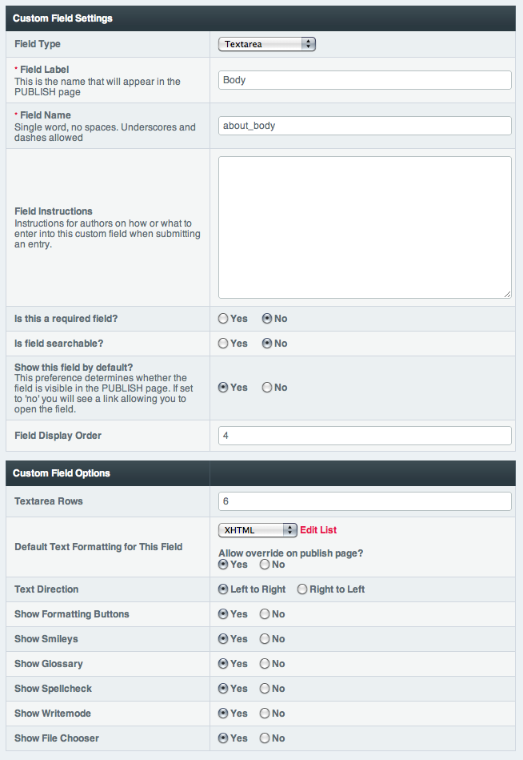

Channel Fields - Add/Edit
=========================

.. rst-class:: cp-path

**Control Panel Location:** :menuselection:`Admin --> Channel Administration --> Channel Fields`

|Channel Field Edit|

This page lets you create or edit fields, which can be one of five
types, described below.

Field Type
~~~~~~~~~~

ExpressionEngine includes the following types of fields for use
in your Channel Entries (add-ons can include their own as well):

#. **Checkboxes**: Checkbox fields display a list of options in the
   publish form that you choose by clicking the checkboxes.
#. **File**: File fields store uploaded files and images, and utilize
   the build in file browser for your publishers to upload and insert
   files.
#. **Multi Select**: Multi Select field types give a list of options in
   a standard multiple selection form control, letting publishers choose
   any or none of the available items.
#. **Radio Buttons**: Radio buttons are similar to Checkbox fields,
   except that you can only select one of the items from the list.
#. **Date**: Date field types are designed to store dates. Next to the
   date field in your PUBLISH page you'll see a calendar and two options
   for your date:

   -  **Localized**: The date will be localized to the timezone of each
      user browsing your site.
   -  **Fixed**: The date will NOT be localized and instead shown at the
      exact date/time you submit.

#. **Relationships**: This is a special and very powerful field type. It
   enables you to create relationships between two or more channels so
   you can show content from one entry within another. For more
   information see :doc:`/modules/channel/relationships`.
#. **Select Dropdown**: This creates a standard HTML <select> drop-down
   list. You can define the contents of the list manually or
   pre-populate it from another field.
#. **Text Input**: This is a single input line for text. It is the type
   of field you might use for a title, name, or other short information.
#. **Textarea**: This is a standard text entry box with multiple lines.
   This is often used for the body text of entries.
#. **Textarea (Rich Text)**: This is a text entry box with multiple
   lines that uses the built-in :doc:`/modules/rte/index`.

Field Label
~~~~~~~~~~~

This is the descriptive name for the field. This is a **required** field
and it may contain spaces or punctuation. Unlike the Field Name, the
label does not need to be unique within the system, so you can use the
same descriptive label on multiple fields in different field groups. The
label is what will be displayed next to the field on the entry form in
your PUBLISH page.

Field Name
~~~~~~~~~~

This is the internal or "short name" for the field. This is a
**required** field and must be a single word with no spaces or
punctuation. The field name must be unique within the system, which
means that you cannot have two field groups each containing a field with
the field name of "body". The short name is typically used as the
variable name in your :doc:`/modules/channel/channel_entries`

.. note:: Some words are reserved and cannot be used. Please
   see :doc:`/general/reserved_words` for details.

Field Instructions
~~~~~~~~~~~~~~~~~~

These are instructions for authors on how or what to enter into the
field when submitting an entry. The instructions will appear below the
Field Label in your PUBLISH page.

Is this a required field?
~~~~~~~~~~~~~~~~~~~~~~~~~

You may determine whether this field is required. If the field is
required and the user leaves it blank, upon submission they will receive
an error message prompting them to correct it.

Is field searchable?
~~~~~~~~~~~~~~~~~~~~

This determines whether the contents of this field will be included in
searches if someone elects to search within the entry content. If you do
not select this field then searches will ignore content stored in this
field.

Show this field by default?
~~~~~~~~~~~~~~~~~~~~~~~~~~~

Here you determine whether or not the field will be shown or hidden on
the publish page by default. If you choose "No", the field will be
collapsed by default and in order to enter content into the field you
will first have to open using the link provided on the publish page.

Additional options
------------------

Additional options will appear depending on the chosen field type.

Default Text Formatting
~~~~~~~~~~~~~~~~~~~~~~~

This option determines the default formatting selection for this field.
(The formatting option can be changed on a per-entry basis when creating
new entries if needed.) This preference will only set the *default*
value for entries created from that point forward. There are three
default choices:

#. **None**: No automatic formatting is done; the text is left as-is.
   This might be useful if you want people to be able to use full HTML
   in this field.
#. **XHTML**: The field content will be formatted with
   ExpressionEngine's :doc:`Auto XHTML feature.
   </general/text_formatting>`
#. **Markdown**: The field content will be formatted with Markdown
   and SmartyPants.
#. **Auto  **: All line breaks in the field content will be
   converted into   tags.

The Edit List link will allow you to specify an ExpressionEngine Plugin
to use for formatting the field. Plugins such as "Textile" and
"Markdown" can be used for this.

If you select the checkbox when you set up the field, then the new
formatting choice will also be applied to this field for **all**
existing entries.

Text Direction
~~~~~~~~~~~~~~

Many foreign languages have text that is written from right to left
instead of left to right, like in English. This preference allows one to
change the direction that text can be written in the Textarea and Text
Input field types.

Show Formatting Buttons
~~~~~~~~~~~~~~~~~~~~~~~

Whether or not to show the HTML formatting buttons with this field.

Show Smileys
~~~~~~~~~~~~

Whether or not to display a popup link to choose from graphical smileys
to insert into the content.

Show Glossary
~~~~~~~~~~~~~

Whether or not to display a link to access the HTML tag glossary.

Show Spellcheck
~~~~~~~~~~~~~~~

Whether or not to display a link to spellcheck the content.

Show Writemode
~~~~~~~~~~~~~~

Whether or not to display a button to allow the author to edit this
field in full-screen Writemode.

Show File Chooser
~~~~~~~~~~~~~~~~~

Whether or not to display a button to allow the author to access the
file browser to select images for insertion into the field content.

Other options
~~~~~~~~~~~~~

Some field types have additional options that may appear in this section
as well. Most options are self-evident, but if you are unsure, check the
documentation for that specific field type.

