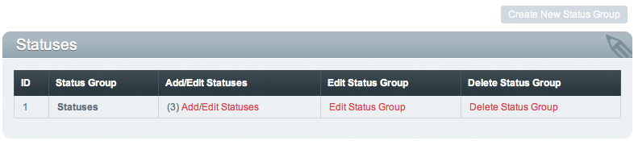

Statuses
========

.. rst-class:: cp-path

**Control Panel Location:** :menuselection:`Admin --> Channel Administration --> Statuses`

|Statuses|

Statuses are markers that can be assigned to your entries in the PUBLISH
page. The two default statuses are Open and Closed, but you can create
others.

If you do not assign a status group to a channel, only Super Admins will
be able to post entries with an 'open' status.

Statuses allow you to flag your entries so that can be controlled in
some way. For example, any entry assigned to a Closed status will never
appear on your site, whereas entries assigned as Open will typically
show up.

Through the use of *parameters* in your `Channel
Entries <../../../modules/channel/channel_entries.html>`_ Tag you can
limit the display of your entries based on the status. This is
particularly useful if you need to create editorial workflow with your
entries. Let's say you have several authors contributing content. You
might create statuses such as First Draft, Second Edit, Final Revision,
Live, etc. to help manage the state of each entry. In this example only
the "live" status would appear on your site.

The main Statuses screen shows a table of all the existing status
groups. It lists the status group name and provides links to edit the
preferences:

-  **Create a New Status Group:** Allows you to create a new group
-  `Add/edit Statuses <statuses_edit.html>`_: Create and edit the
   statuses that belong to the status group.
-  **Edit Status Group**: Edit the name of the existing status group.
-  **Delete Status Group**: Delete the status group.

