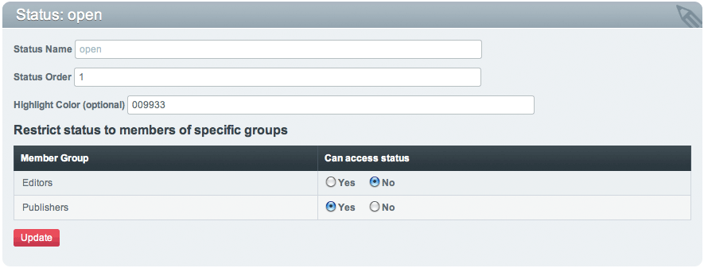

Add/Edit Statuses
=================

.. rst-class:: cp-path

**Control Panel Location:** :menuselection:`Admin --> Channel Administration --> Statuses`

This page allows you to add new statuses or edit existing statuses.

|Add/Edit Statuses|

Status Name
~~~~~~~~~~~

This is the name for the status. It is what will be displayed when
creating a new channel entry. This is a **required** field and it may
contain spaces or punctuation.

Status Order
~~~~~~~~~~~~

The order number for this status.

Highlight Color
~~~~~~~~~~~~~~~

This optional field allows you to specify a highlight color for this
status. This is the color of the status name in the :doc:`/cp/content/edit`
main table. Entries assigned to this status will have their status name
in this color. That way you can easily make a specific status stand out
in that table.

This field will take standard `CSS color
values <http://www.w3.org/TR/REC-CSS1#color-units>`_ as input. That
means you can use color keywords such as red, aqua, and navy; or you
could define a specific RGB value in a standard method such as #f00 or
#ff0000.

Restrict status to members of specific groups
~~~~~~~~~~~~~~~~~~~~~~~~~~~~~~~~~~~~~~~~~~~~~

If any of your Member Groups (besides the Super Admin group) grant
access to the Control Panel you will see a table that allows you to
specify whether or not each group can access a particular status. If a
Member Group can access the status then it will appear as an option in
the Publish page for users of that Member Group.

This feature can be used to establish a workflow for multiple Member
Groups. One group might submit entries that are placed in a "closed" or
"draft" type status while another group can review the entry and assign
it to be "open".

