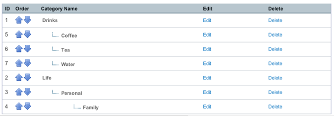
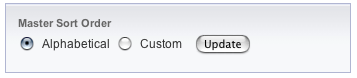

Add/Edit Categories
===================

Control Panel Location: Admin > Channel Administration > Category
Management > Add/Edit Categories
|Edit Categories|
This screen lists the existing categories, showing the hierarchical
relationship between the categories.

You may also `Add New Categories <category_create.html>`_ to the group
or to edit existing categories.

ID
~~

The ID associated with the category.

Order
~~~~~

You can use these arrows to arrange your categories in the order you
want. Move a category up or down in the list by clicking on the
appropriate arrow.

Category Name
~~~~~~~~~~~~~

The name of the category. The hierarchical relationship is also
displayed by the indenting and dotted lines.

Edit
~~~~

Follow this link to edit the category.

Delete
~~~~~~

Follow this link to delete the category

Master Sort Order
~~~~~~~~~~~~~~~~~

|Sort Order|
This preference has two setting options:

#. **Alphabetical**: The entries will be sorted alphabetically based on
   the hierarchy. All the first-level categories will be listed
   alphabetically and then subcategories within those will each be
   listed alphabetically.
#. **Custom**: You may specify a custom order by arranging the
   categories in the desired order using the arrows next to each
   category.

