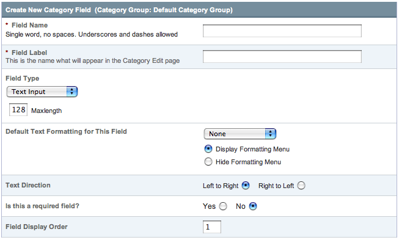

Category Fields - Add/Edit
==========================

.. rst-class:: cp-path

**Control Panel Location:** :menuselection:`Admin --> Channel Administration --> Categories --> Add/Edit`

This page lets you create or edit fields, which can be one of three
types, described below.

|Add or Edit Category Field|

Field Name
~~~~~~~~~~

This is the internal or "short name" for the field. This is a
**required** field and must be a single word with no spaces or
punctuation. The field name must be unique within the site, which means
that you cannot have two category groups each containing a field with
the field name of "extra". The short name is typically used as the
variable name in your category related tags.

.. note:: Some words are reserved and cannot be used. Please see the
   list of :ref:`reserved-words-fields` for details.

Field Label
~~~~~~~~~~~

This is the descriptive name for the field. This is a **required** field
and it may contain spaces or punctuation. Unlike the Field Name, the
label does not need to be unique, so you can use the same descriptive
label on multiple fields in the same category field groups. The label is
what will be displayed next to the field on the entry form in your Edit
Category page.

Field Type
~~~~~~~~~~

You may choose what type of field this is. There are three choices:

#. **Text Input**: This is a single input line for text. It is the type
   of field you might use for a title, name, or other short information.
#. **Textarea**: This is a standard text entry box with multiple lines.
   This is what you would use for a main entry body.
#. **Drop-down List**: This creates a standard HTML <select> drop-down
   list. You can define the contents of the list manually or
   pre-populate it from another custom field.

Default Text Formatting
~~~~~~~~~~~~~~~~~~~~~~~

This option determines the default formatting selection for this field.
(The formatting option can be changed on a per-category basis when
creating new categories if needed.) This preference will only set the
*default* value for categories created from that point forward. There
are three default choices:

#. **None**: No automatic formatting is done; the text is left as-is.
   This might be useful if you want people to be able to use full HTML
   in this field.
#. **XHTML**: The field content will be formatted with
   ExpressionEngine's `Auto XHTML
   feature. <../../../general/text_formatting.html>`_
#. **Auto  **: All line breaks in the field content will be
   converted into   tags.

Additionally, any ExpressionEngine Plugins you have installed will be
listed, allowing you to specify a plugin to use for formatting the
field. Plugins such as "Textile" and "Markdown" can be used for this.

If you select the checkbox when you set up the field, then the new
formatting choice will also be applied to this field for **all**
existing entries.

Is this a required field?
~~~~~~~~~~~~~~~~~~~~~~~~~

You may determine whether this field is required. If the field is
required and the user leaves it blank, upon submission they will receive
an error message prompting them to correct it.

Field Display Order
~~~~~~~~~~~~~~~~~~~

You can determine the order in which the fields appear on your channel
entry screen.

Text Direction
~~~~~~~~~~~~~~

Many foreign languages have text that is written from right to left
instead of left to right, like in English. This preference allows one to
change the direction that text can be written in the Textarea and Text
Input custom field types.

