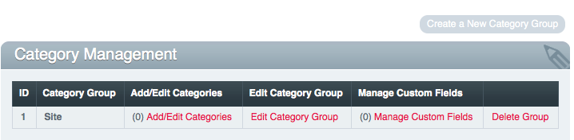

Category Management
===================

Control Panel Location: Admin > Channel Administration > Category
Management
|Category Overview|
This section of the Control Panel is for the management of channel
categories. It is where categories and category groups are created,
deleted, and preferences are set.

Category groups are *collections* of categories that can be assigned to
channels. You can create a separate group for each channel or use the
same group on multiple channels.

The main Category Management screen shows a table of all the existing
category groups. It lists the category group name and provides links to
edit the preferences.

-  `Create a New Category Group <category_create_group.html>`_: Enables
   you to Create a new Category Group.
-  `Add/edit Categories <category_edit.html>`_: Create and edit the
   categories that belong to a category group.
-  **Edit Group**: Edit the preferences of an existing category group.
-  `Manage Custom Fields <category_field_management.html>`_: Create and
   Edit custom fields for the category group.
-  **Delete Group**: Delete the category group and all the categories it
   contains.

