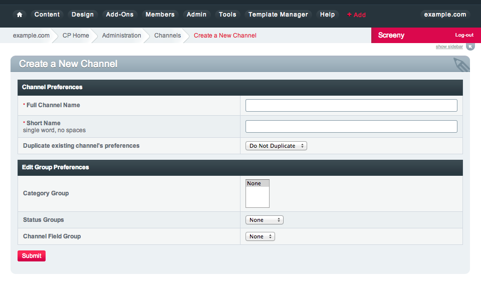

Create a New Channel
====================

|Channel Create|
Short Name
~~~~~~~~~~

The "short name" for the channel is the name used internally within the
program. It is also used when specifying a channel in variables of
parameters in your `Templates <../../design/templates/index.html>`_. It
is not normally shown to visitors or otherwise exposed outside of your
channel "setup".

The channel's short name is a required field. It must be a single word
with no spaces. The underscore character is allowed. For example, the
channel's "short name" might be joe\_channel.

Full Channel Name
~~~~~~~~~~~~~~~~~

The "full channel name" is the descriptive name for the channel. This is
the name of your channel that you will show to visitors and display on
your site.

The full channel name is a required field. Spaces, punctuation, and
other special characters are allowed. For example, the channel's
descriptive name might be Joe's Personal Channel.

Duplicate existing channel's preferences
~~~~~~~~~~~~~~~~~~~~~~~~~~~~~~~~~~~~~~~~

Allows you to duplicate the preferences from an existing channel.

Edit Group Preferences
~~~~~~~~~~~~~~~~~~~~~~

Allows you to set the group preferences for a channel upon creation.

**Note:** Changing these settings will override the settings that would
be applied when duplicating an existing channel's preferences

Category Group
^^^^^^^^^^^^^^

Allows you to select the Category Group(s) to assign to this channel

Status Group
^^^^^^^^^^^^

Allows you to select the Status Group to assign to this channel

Field Group
^^^^^^^^^^^

Allows you to select the Channel Field Group to assign to this channel

Create New Templates For This Channel?
~~~~~~~~~~~~~~~~~~~~~~~~~~~~~~~~~~~~~~

With this setting you can specify whether you would like Templates and a
Template Group to be automatically created. If you choose to have
Templates created then you can base them off of either one of the
default "Themes" or from an existing Template Group.

ExpressionEngine will go through the Templates and attempt to update
them for use with the newly created channel. This would include things
such as altering the channel="default\_site" parameter in channel
entries tags. ExpressionEngine cannot always be 100% accurate in this so
you're encouraged to go through the Templates and ensure they are
correct. The system will also not be able to do things such as place
your channel entry field variables in the Template.

The feature should greatly help get you on your way when creating a new
channel, though.

