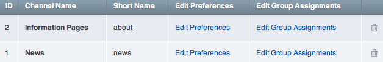

Channel Management
==================

Control Panel Location: Admin > Channel Administration > Channels
This section of the Control Panel is for the management of channels. It
is where channels are created, deleted, and preferences are set.

|Channel Overview|
The main Channel Management screen shows a table of all the existing
channels. It lists the channel's full name and provides links to edit
the preferences.

-  `Create a New Channel <channel_create.html>`_: Enables you to create
   a new Channel
-  `Edit Preferences <channel_edit_preferences.html>`_: Edit all the
   preferences for the channel.
-  `Edit Groups <channel_groups.html>`_: Assign the category group,
   status group, and field group to use with that channel.
-  `Delete <channel_delete.html>`_: Delete the channel.

