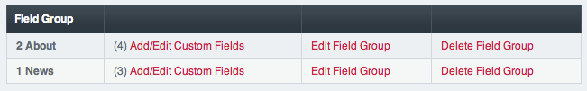

Channel Fields
==============

Control Panel Location: Admin > Channel Administration > Channel Fields
|Channel Fields Overview|
This section of the Control Panel lets you manage your Channel Field
Groups.

Field Groups determine what fields will appear in your control panel
PUBLISH page. You can create a separate group for each channel or use
the same group on multiple channels.

-  **Create a New Channel Field Group**: Allows you to create new
   groups.
-  `Add/Edit Custom Fields <custom_fields_edit.html>`_: Create and edit
   the fields that belong to a field group.
-  **Edit Field Group**: Edit the name of the existing field group.
-  **Delete Field Group**: Delete the field group and all the fields it
   contains.

