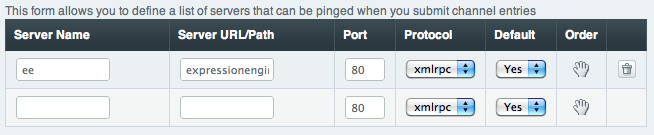

Default Ping Servers
====================

Control Panel Location: Admin > Channel Administration > Default Ping
Servers
This section of the Control Panel allows you to define your default
*ping servers*. Ping servers are sites that allow you to send a "ping"
to them to let them know that you've posted a new entry. Pings can be
sent when you submit new entries via the PUBLISH page. Examples include
`weblogs.com <http://www.weblogs.com/>`_ and `Blo.gs <http://blo.gs/>`_,
among others.

**Note:** Each member of your site is allowed to specify their preferred
ping servers via their My Account page. These default servers are
**only** used with members that have not defined their own.

|Ping Servers|
Server Name
~~~~~~~~~~~

A descriptive name for the server or service. This name will appear in
the PUBLISH page.

Server URL/Path
~~~~~~~~~~~~~~~

The URL where the ping should be sent. This information will be
available from the the particular site receiving the ping. Example:
http://rpc.channels.com/RPC2

Port
~~~~

This specifies which server port should be used to send the ping. HTTP
is typically sent on port 80; you can change this if the ping service
uses a different port. This information should be available from the
service.

Protocol
~~~~~~~~

What protocol should be used to send the ping. Different ping servers
accept the data in different protocols. This information should be
available from the service; it may be listed for "developers" or in a
section about how to send a ping. Currently only **XML-RPC** is
supported.

Default
~~~~~~~

This setting determines whether or not you want the checkbox for this
ping server to be selected by default in the PUBLISH page.

Order
~~~~~

These settings determine the order in which the ping servers are
displayed in the PUBLISH page. "1" is listed first, "2" second, and so
on. Simply put the ping servers in the order you wish by placing the
numbers appropriately in the boxes.

Deleting
--------

Delete an existing ping server by removing the Server Name and then
submitting the form. Ping server deletion is permanent and irreversible,
so **be very careful before deleting a ping server**. There is **no
verification** performed; once you submit the ping server is removed
immediately.

