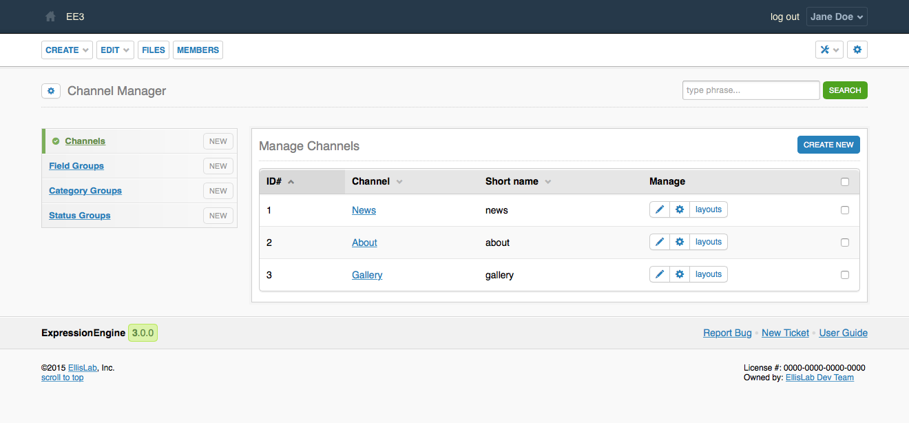

Channels
========

.. rst-class:: cp-path

**Control Panel Location:** :menuselection:`Developer --> Channels`

.. Overview

This section of the Control Panel is where channels are created, edited and
deleted.

.. Screenshot (optional)

.. Permissions

Permission Restrictions
-----------------------

* Access settings: Design & Content
* Channels: Create Channels
* Channels: Edit Channels
* Channels: Delete Channels

Actions
-------

.. contents::
  :local:
  :depth: 1

.. Each Action

.. include:: /cp/channel/_header.rst

New
^^^

This button will allow you to :doc:`create a new channel <form>`.

Import
~~~~~~

This will take you to :doc:`import` where you can import a :doc:`channel set </channel/sets>`.

Channel Links
~~~~~~~~~~~~~

This will take you to the channel's :doc:`edit form <form>`.

Manage
~~~~~~

The icons in the manage column perform actions on the channel in its row.

Edit
^^^^

This will take you to the channel's :doc:`edit form <form>`.

Export
^^^^^^

This will download a :doc:`Channel Set </channel/sets>`.

Layouts
^^^^^^^

This will take you to the channel's :doc:`Layouts </channel/layouts/index`.

Bulk Actions
~~~~~~~~~~~~

The checkbox in the right-most column of the table selects a button for a bulk
action. When at least one checkbox is checked the bulk action dropdown menu and
submit button will be made available in the lower righthand corner of the table.

Remove
^^^^^^

The selected channels will be removed. Removing a channel will cause a
confirmation modal to appear that will summarize the action.

