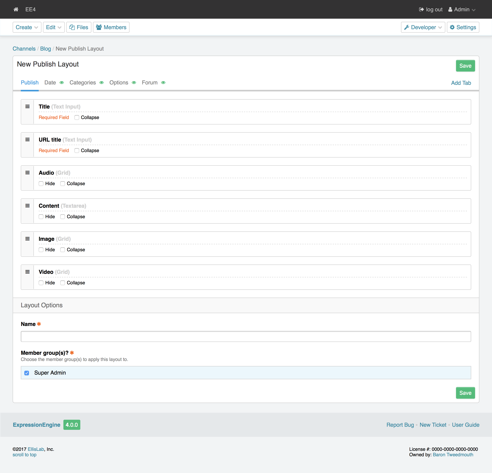

.. # This source file is part of the open source project
   # ExpressionEngine User Guide (https://github.com/ExpressionEngine/ExpressionEngine-User-Guide)
   #
   # @link      https://expressionengine.com/
   # @copyright Copyright (c) 2003-2018, EllisLab, Inc. (https://ellislab.com)
   # @license   https://expressionengine.com/license Licensed under Apache License, Version 2.0

Create/Edit Form Layouts
========================

.. rst-class:: cp-path

**Control Panel Location:** :menuselection:`Developer --> Channels --> Layouts --> New/Edit`

.. Overview

.. Screenshot (optional)

.. Permissions

Permission Restrictions
-----------------------

* Access settings: Design & Content
* Channels: Edit Channels

Fields
-------

.. contents::
  :local:
  :depth: 1

.. Each Fields

.. todo:: Document the fields