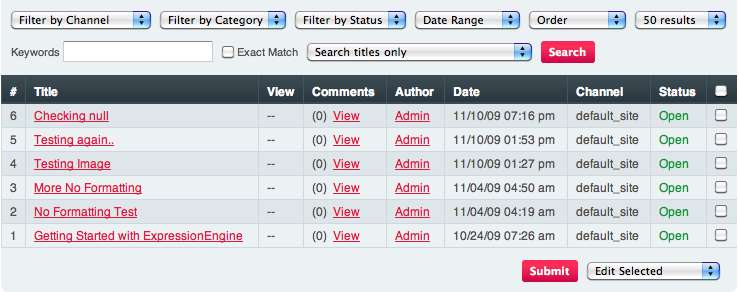

Edit Page
=========

.. rst-class:: cp-path

**Control Panel Location:** :menuselection:`Content --> Edit`

In this section you can edit and update previously posted
Entries. By using the drop-down menus the list can be filtered by
Channel, Category, Status, or Date range. In addition, you can select
multiple entries using the checkboxes on the right, then either delete
them or edit them using the option menu at the bottom of the page.

|Edit Page|

Main Display
~~~~~~~~~~~~

Search and Filter
~~~~~~~~~~~~~~~~~

The top of the Edit page allows you to filter and search for entries
using a various criteria such as channel, category, date, order, etc.

The main table shows the following columns:

-  **#**: The entry ID number for the entry.
-  `**Entry Title** <./publish.html>`_: Clicking the link will open the
   entry for editing.
-  **View**: The link in this column will display the entry for you.
-  **Live Look**: This link allows you to view the entry in a template
   of your choice. This will appear in place of the View link when a
   template is specified in the
   `preferences <../admin/content_admin/channel_edit_preferences.html>`_
   for the channel.
-  `Comments <../../modules/comment/control_panel/index.html>`_: The
   "View" link allows you to edit the comments.
-  **Author**: The name of the entry author.
-  **Date**: The date and time assigned to the entry.
-  `**Channel** <../admin/content_admin/channel_management.html>`_: The
   short name of the channel that the entry is assigned to.
-  `**Status** <../admin/content_admin/statuses.html>`_: The status that
   the entry is assigned to.

Multi-Entry Editing/Deleting
~~~~~~~~~~~~~~~~~~~~~~~~~~~~

At the bottom of the Edit page is a pulldown menu that allows all
entries that have been checked to be edited or deleted.

The Edit page contains "magic checkbox" code, allowing you to click
anywhere on row to select a checkbox. You can shift-select multiple
rows.

Multi Entry Category Editing
~~~~~~~~~~~~~~~~~~~~~~~~~~~~

The Edit page actions pulldown menu has the ability to add or remove
categories from multiple entries quickly. Simply choose the entries you
want to add or remove categories from and click the submit button. The
next page will allow you to select what categories to add or remove from
those entries.

