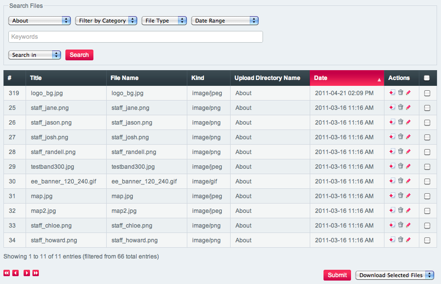
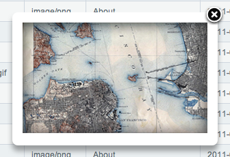
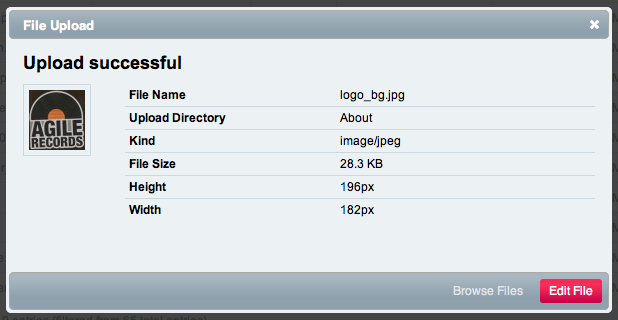

File Manager
============

Control Panel Location: Content > Files > File Manager
On the main File Manager page, you can view all of your previously
uploaded files. Files are filterably by by upload location, category,
file type and date range, as well as being searchable. In addition, you
can select multiple files using the checkboxes on the right, then you
can either download the files or delete them using the option menu at
the bottom of the page.

Main File View
--------------

|File Manager Upload Directory|
The Main File View shows the following columns:

-  **#**: The ID number for the file.
-  **Title**: The title of the file.
-  **File Name**: The file name in the file system. If the file is an
   image, clicking this will bring up an overlay showing the image.
-  **Kind**: The kind of the file, for example, image/png,
   application/pdf, or text/html.
-  **Upload Directory**: The name of the upload directory where the file
   resides.
-  **Date**: The date the file was uploaded.
-  **Actions**: Three actions you can perform on the file: download,
   delete, and edit.

|File Manager Quick Look|
Clicking on an image’s File Name will bring up an overlay showing you
the image.

Uploading Files
---------------

Files can be uploaded from the File Manager to any of the directories
available to you. Start by clicking the Upload button.

|File Manager File Upload|
Then, select the upload directory where you want the file to go and then
select your file and click Upload File.

|File Manager File Upload Success|
After the file is uploaded, you’ll be shown a summary of the file,
including a thumbnail and some file details. Note that the filename is
automatically sanitized to remove spaces and other disallowed characters
and the file renamed if necessary.

|image5|
If you close the dialog by either clicking the close button in the top
right corner or by clicking Browse Files on the bottom, you’ll be shown
the file table again, with the most recent file on the top.

File Actions
------------

Download File
~~~~~~~~~~~~~

|Download File Icon| Clicking this icon will download the file.

Delete File
~~~~~~~~~~~

|Delete File Icon| Clicking this icon will delete the file.

Edit File
~~~~~~~~~

|Edit File Icon| Clicking this icon will take you to the edit file page.

Batch File Actions
------------------

Download Selected Files
~~~~~~~~~~~~~~~~~~~~~~~

Files selected from a directory on in the main view can be batch
downloaded using this option. The files will be offered as a
downloadable zip file.

Delete Selected Files
~~~~~~~~~~~~~~~~~~~~~

Files selected from a directory on in the main view can be batch deleted
using this option.

.. |File Manager File Upload| image:: ../../../images/files/upload.png

.. |image5| image:: ../../../images/files/highlighted_row.png

