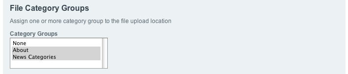
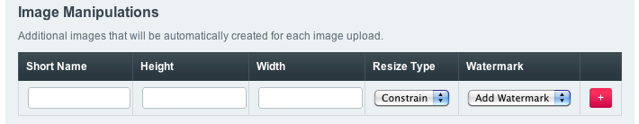
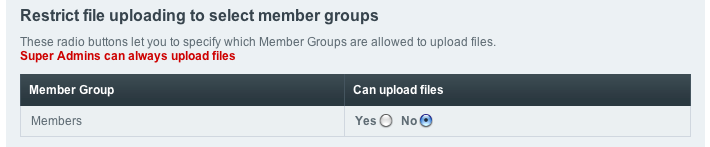

File Upload Preferences
=======================

.. rst-class:: cp-path

**Control Panel Location:** :menuselection:`Content --> Files --> File Upload Preferences`

This section of the Control Panel allows you to manage file upload
destinations. These destinations determine where you can upload files
when using the upload utility on the Publish page. You can create as
many destinations as you need in order to organize your uploaded images
in the manner you wish.

**Note:** This utility will **not** create the actual destination folder
on your server so you'll need to do that using your FTP program. In
addition, you must set the file permissions for that folder to 777 so
that ExpressionEngine will be allowed to put files into it.

Main Screen
-----------

The main File Upload Preferences page shows a list of all the existing
upload destinations.

|File Upload Prefs|

The Synchronize icon allows you to synchronize the file records in the
database with the files stored in a given upload directory. See
`Synchronize Files <sync_files.html>`_ for details on how this works.

The Create New Upload Destination button takes you to a page where you
can create a new destination, or you can click the Edit icon to edit an
existing destination. Either of these options will take you to the
following page:

Create/Edit Upload Destination
------------------------------

|File Upload Directory Prefs|

Descriptive name of upload directory
~~~~~~~~~~~~~~~~~~~~~~~~~~~~~~~~~~~~

This is the descriptive name of the upload destination. It is a
**required** field and must be unique, but spaces are allowed. This name
will appear when uploading files via the PUBLISH page.

Server Path to Upload Directory
~~~~~~~~~~~~~~~~~~~~~~~~~~~~~~~

The **full server path** (not a URL) to the upload folder for
this destination.  For example::

	/home/user/example.com/public_html/images/uploads/
	
If you are not sure how to determine your server path please contact
your hosting company.

URL of Upload Directory
~~~~~~~~~~~~~~~~~~~~~~~

The **full URL** to the new destination. For example: http://example.com/images/uploads/

Overriding Upload Paths and URLs Using Configuration Variables
~~~~~~~~~~~~~~~~~~~~~~~~~~~~~~~~~~~~~~~~~~~~~~~~~~~~~~~~~~~~~~

Once upload destinations are created, you can optionally override upload
destination paths, URLs and titles in config.php. For each upload
destination, you can add an associative array to the
``$config['upload_preferences']`` variable::

	$config['upload_preferences'] = array(
	    1 => array(                                                            // ID of upload destination
	        'name'        => 'Staging Image Uploads',                          // Display name in control panel
	        'server_path' => '/home/user/example.com/staging/images/uploads/', // Server path to upload directory
	        'url'         => 'http://staging.example.com/images/uploads/'      // URL of upload directory
	    )
	);

Each key in the array is optional and only overrides existing values in
the database, new upload destinations cannot be created using this
configuration variable.

Allowed File Types
~~~~~~~~~~~~~~~~~~

This preference will determine how the system handles the uploaded
files. You have two choices for this preference:

#. **Images only**: With this preference set, the system will only allow
   image files of the type GIF, JPG, JPEG, or PNG.
#. **All file types**: This option will allow you to upload files of any
   type to the system. **Be careful** with this setting since it could
   be possible for someone to upload a malicious file.

**Note:** Only file types that are specified in ExpressionEngine's Mime
Type file are allowed to be uploaded. If you are uploading something
uncommon and run into problems you may need to add the mime type for
your file. The Mime Type file can be found at:
system/expressionengine/config/mimes.php

Maximum File Size (in bytes)
~~~~~~~~~~~~~~~~~~~~~~~~~~~~

You can optionally set a maximum allowed size for uploaded file. Leave
the setting blank if you do not wish to impose a limit. The size is
defined in bytes; 1 kilobyte = 1024 bytes. Example: to limit each upload
to 30 kilobytes, you'll put 30720 in the field.

**Note:** Servers usually also have built-in limits on the amount of
data that can be uploaded via PHP at one time. The default value for
this in PHP is 2 MB. If you have a need to upload very large files, then
you should contact your Host or server admin and talk to them about any
size limits they have in place.

Maximum Image Height (in pixels)
~~~~~~~~~~~~~~~~~~~~~~~~~~~~~~~~

You can optionally set the maximum allowed height for uploaded images,
images over this setting will be automatically resized. Leave both this
setting and the maximum width setting blank if you do not with to impose
a limit. The size is defined in pixels. This option only applies to
uploaded images and not other file types.

Maximum Image Width
~~~~~~~~~~~~~~~~~~~

You can optionally set the maximum allowed width for uploaded images,
images over this setting will be automatically resized. both this
setting and the maximum height setting blank if you do not with to
impose a limit. The size is defined in pixels. This option only applies
to uploaded images and not other file types.

**Note:** If either the maximum height or maximum width is set and the
other left blank, images that exceed the specified setting will still be
resized, using the specified setting as the master dimension.

Image Properties
~~~~~~~~~~~~~~~~

These properties will be added inside the image tag (if an image is
uploaded). Leave this setting blank if you do not wish for any
properties to be added.

For example: If you have border="0" alt="image" name="image" set as your
preference, when you upload an image, the resulting tag will look like
this::

	

Image Pre Formatting
~~~~~~~~~~~~~~~~~~~~

This setting lets you specify data to be placed *before* the HTML for an
uploaded image. Using this (and the following) setting you can easily
"wrap" your file code. For example, you could use 
.

Image Post Formatting
~~~~~~~~~~~~~~~~~~~~~

This setting lets you specify data to be placed *after* the HTML for an
uploaded image. Using this (and the previous) setting you can easily
"wrap" your file code. For example, you could use 
. Together with
the previous setting you would get this output::

	

File Properties
~~~~~~~~~~~~~~~

These properties will be added inside the link tag (if a file is
uploaded). Leave this setting blank if you do not wish for any
properties to be added.

For example: If you have title="file\_name" set as your preference, when
you upload a file, the resulting tag will look like this::

	<a href="http://example.com/images/upload/plan.txt" title="file_name">plan.txt</a>

File Pre Formatting
~~~~~~~~~~~~~~~~~~~

This setting lets you specify data to be placed *before* the HTML for an
uploaded file (non-image). Using this (and the following) setting you
can easily "wrap" your file code. For example, you could use 
.

File Post Formatting
~~~~~~~~~~~~~~~~~~~~

This setting lets you specify data to be placed *after* the HTML for an
uploaded file (non-image). Using this (and the previous) setting you can
easily "wrap" your file code. For example, you could use 
.
Together with the previous setting you would get this output::

	
<a href="http://example.com/images/upload/plan.txt" >plan.txt</a>

File Category Groups
~~~~~~~~~~~~~~~~~~~~

|File Categories|

You may assign multiple category groups to a file upload directory,
which will allow you to assign categories to any uploaded files.

Image Manipulations
~~~~~~~~~~~~~~~~~~~

|Image Manipulations|

This setting allows you to specify multiple thumbnail images that will
be automatically created when a file is uploaded.

The short name will be used in templates to display the generated
thumbnail. Images will be resized according to the height and width
settings. If only height or width is specified, the thumbnails will be
created using that as the master dimension. For example, setting the
height to 200 and leaving the width blank will result in an image that
is no higher than 200 pixels, with the width resized proportionately.
Setting both the height and the width to 200 would result in an image
that is no higher or wider than 200 pixels.

Resize type will determine whether the image is constrained (resized) or
cropped to the specified dimensions. You may also assign a watermark to
the image if any `watermark settings <watermark_preferences.html>`_
exist.

Restrict file uploading to select member groups
~~~~~~~~~~~~~~~~~~~~~~~~~~~~~~~~~~~~~~~~~~~~~~~

|Restrict to select member groups|

This setting allows you to specify which member groups have permission
to upload files to this file upload destination. By default, only the
"Members" group and any user-created member groups are listed. Super
Admins can always upload files.

.. |File Upload Prefs| image:: ../../../images/files/upload_listing.png
.. |File Upload Directory Prefs| image:: ../../../images/files/upload_preferences.png

