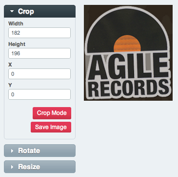
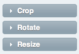
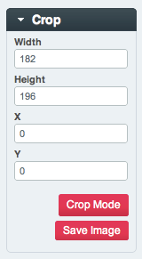
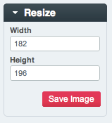
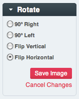

Image Editor
============

Control Panel Location: Content > Files > File Manager > Image Editor
The Image Editor page of the Control Panel allows you perform basic
image editing tasks directly from ExpressionEngine. It is not intended
to replace powerful image editing software such as Photoshop or Gimp,
but rather to provide a quick option for common tasks from within the
control panel.

|Image Editor|
Edit Modes
----------

|Image Editor Modes|
Crop Mode
~~~~~~~~~

When in crop mode ExpressionEngine will present both a graphical crop
tool over the image, and specific pixel references. When the area you
want to crop has been selected, choose Save Image to save your changes.

|Image Editor Crop|
|Image Editor Crop Options|
Resize Mode
~~~~~~~~~~~

When in resize mode ExpressionEngine will allow for image resizing by
either dragging the sides of the image, or by entering the exact
measurements you want into the sidebar. Note that ExpressionEngine
attempts to keep the aspect ratio (proportions) or your image intact.

|Image Editor Resize Mode|
Rotate Mode
~~~~~~~~~~~

In rotate mode ExpressionEngine will provide options for simple
clockwise or counter-clockwise 90° rotations, as well as the option to
flip your image vertically and horizontally.

|File Manager Rotate Mode|

