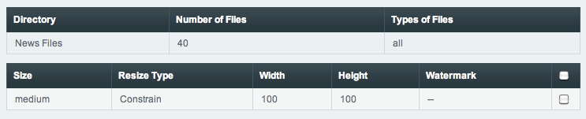

Synchronize Files
=================

.. rst-class:: cp-path

**Control Panel Location:** :menuselection:`Content --> Files --> File Upload Preferences --> Synchronize Files`

The Synchronize Files page allows you to synchronize the file records in
the database with the files stored in a given upload directory. When
submitted, all allowed file types in the directory will be checked
against the file records in the database. If there is no record in the
database, one will be added. For images, any additional sizes will be
generated and watermarked according to the file upload preferences for
that directory. Lastly, any records in the database that do not have a
corresponding file in the main directory will be deleted from the
database along with any existing resized images. Existing images may
also be set to regenerate resized images from this page.

Synchronization Options
-----------------------

|File Synchronization Overview|

An overview of the directory and the directory settings will be shown on
the synchronization page. This includes the total number of files to be
cycled through and they type of files that will be included (all files
versus images only).

If there are any resize types for the directory, they will be shown in a
separate table.

Regenerate Existing Images
~~~~~~~~~~~~~~~~~~~~~~~~~~

By default, synchronization will only generate thumbnails for missing
images. Checking a resize option overrides that default behavior, and
new thumbnails for any of the selected options will be recreated based
on the current file upload preferences, replacing any existing
thumbnails. This is useful if the settings for image dimensions and/or
watermarks have changed and you would like the existing thumbnails
replaced.

