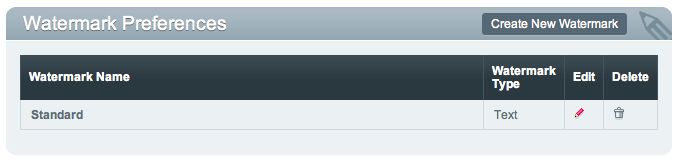
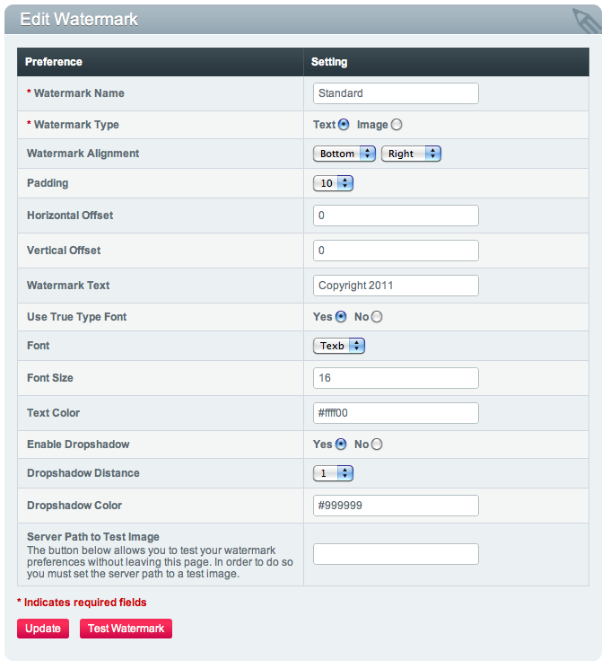

Watermark Preferences
=====================

Control Panel Location: Content > Files > Watermark Preferences
This section of the Control Panel allows you to manage watermark
settings. A watermark is a unique text string or graphic that is
automatically added to your images to mark them as "yours" and to hamper
other people from being able to "steal" your images. You can create as
many watermark types as you need and apply them to your automatically
created thumbnails in the :doc:`file_upload_preferences`.

Main Screen
-----------

The main Watermark Preferences page shows a list of all the existing
watermark settings.

|File Watermark Prefs|
The Create New Watermark button takes you to a page where you can create
a new watermark, or you can click the Edit link to edit an existing
watermark setting. Either of these options will take you to the
following page:

Create/Edit Watermark
---------------------

|image2|

Text Version
------------

You may apply a text string to be watermarked on your images.

Watermark Alignment
~~~~~~~~~~~~~~~~~~~

Here you select where you want the watermark to appear. The first
drop-down allows you to select the vertical position (top, middle,
bottom) while the second allows you to specify the horizontal position
(left, center, right).

Padding
~~~~~~~

This is the amount of padding that will automatically be applied to the
watermark to set it away from the edge of your images.

Horizontal Offset
~~~~~~~~~~~~~~~~~

You may specify a horizontal offset (in pixels) to apply to the
watermark position. If you have your alignment set to "right" then your
offset value will move the watermark toward the "center" of the image.

Vertical Offset
~~~~~~~~~~~~~~~

You may specify a vertical offset (in pixels) to apply to the watermark
position. If you have your alignment set to "bottom" then your offset
value will move the watermark toward the "center" of the image.

Apply Watermark to Thumbnails
~~~~~~~~~~~~~~~~~~~~~~~~~~~~~

This determines whether you want the watermark to be added to any
automatically-created thumbnail images.

Apply Watermark to Medium Sized Images
~~~~~~~~~~~~~~~~~~~~~~~~~~~~~~~~~~~~~~

This determines whether you want the watermark to be added to any
automatically-created medium sized images.

Watermark Text
~~~~~~~~~~~~~~

Specify the text you wish to be used for the watermark.

Use True Type Font
~~~~~~~~~~~~~~~~~~

Specify whether or not to use a True Type font. In order to be able to
use this option, True Type font support must be included in your PHP
installation. Not all Hosts and servers support this. True Type fonts
will appear to be smoother than if you disable this option.

Font
~~~~

This is a drop-down of the available True Type fonts. By default, the
"texb" font is included with ExpressionEngine. If you wish to use a
different font then you will need to upload it to your system/fonts/
directory.

**Note**: The font selection works only when "Use True Type Font" is
enabled.

Font Size
~~~~~~~~~

The font size (in px) you wish to use with the watermark text. Note that
this is the font size that will be applied to the full-size image. The
font size will be scaled proportionally with the image size if applied
to the thumbnail or medium sized image.

**Note**: The font size selection works only when "Use True Type Font"
is enabled.

Text Color
~~~~~~~~~~

You may specify any standard hex code for the font color. You may also
click the color swatch image next to the preference to launch a pop-up
window containing a library of colors from which you can choose.

Enable Dropshadow
~~~~~~~~~~~~~~~~~

You may specify to have a dropshadow applied to your watermark text.
Dropshadows usually make the text easier to read, especially when used
on images with greatly varying color.

Dropshadow Distance
~~~~~~~~~~~~~~~~~~~

The distance (in pixels) to offset the dropshadow from the regular text.

Dropshadow Color
~~~~~~~~~~~~~~~~

You may specify any standard hex code for the dropshadow color. You may
also click the color swatch image next to the preference to launch a
pop-up window containing a library of colors from which you can choose.

Server Path to Test Image
~~~~~~~~~~~~~~~~~~~~~~~~~

If you wish to test your watermark settings then you may specify the
server path to a test image. This will allow you to see how it would
actually appear on a real image. A server path is typically something
similar to /home/domain.com/http\_docs/cp\_images/watermark\_test.jpg.
The specific setting will vary from server to server so you may need to
contact your Host or server admin to determine what your correct "server
path" is.

Test your Watermark Settings
~~~~~~~~~~~~~~~~~~~~~~~~~~~~

This button will allow you to view how your watermark will look when
applied to an actual image. You need to make sure that the "Server Path
to Test Image" preference above is set correctly before you will be able
to test the settings. This will open a pop-up window and display a
watermarked image. You may then make changes to your watermark settings
and test again.

Graphic Version
---------------

You may use a graphic file as your watermark.

Watermark Alignment
~~~~~~~~~~~~~~~~~~~

Here you select where you want the watermark to appear. The first
drop-down allows you to select the vertical position (top, middle,
bottom) while the second allows you to specify the horizontal position
(left, center, right).

Padding
~~~~~~~

This is the amount of padding that will automatically be applied to the
watermark to set it away from the edge of your images.

Horizontal Offset
~~~~~~~~~~~~~~~~~

You may specify a horizontal offset (in pixels) to apply to the
watermark position. If you have your alignment set to "right" then your
offset value will move the watermark toward the "center" of the image.

Vertical Offset
~~~~~~~~~~~~~~~

You may specify a vertical offset (in pixels) to apply to the watermark
position. If you have your alignment set to "bottom" then your offset
value will move the watermark toward the "center" of the image.

Apply Watermark to Thumbnails
~~~~~~~~~~~~~~~~~~~~~~~~~~~~~

This determines whether you want the watermark to be added to any
automatically-created thumbnail images.

Apply Watermark to Medium Sized Images
~~~~~~~~~~~~~~~~~~~~~~~~~~~~~~~~~~~~~~

This determines whether you want the watermark to be added to any
automatically-created medium sized images.

Server Path to Watermark Image
~~~~~~~~~~~~~~~~~~~~~~~~~~~~~~

The server path to the image you wish to use as your watermark. A server
path is typically something similar to
/home/domain.com/http\_docs/cp\_images/watermark\_test.jpg. The specific
setting will vary from server to server so you may need to contact your
Host or server admin to determine what your correct "server path" is.

Watermark Opacity
~~~~~~~~~~~~~~~~~

You may specify the opacity (i.e. transparency) of your watermark image.
This allows the watermark to be faint and not completely obscure the
details from the original image behind it. A 50% opacity is typical.

Transparency X Coordinate
~~~~~~~~~~~~~~~~~~~~~~~~~

If your watermark image is a PNG or GIF image, you may specify a color
on the image to be "transparent". This setting (along with the next)
will allow you to specify that color. This works by specifying the "X"
and "Y" coordinate pixel (measured from the upper left) within the image
that corresponds to a pixel representative of the color you want to be
transparent.

Transparency Y Coordinate
~~~~~~~~~~~~~~~~~~~~~~~~~

Along with the previous setting, this allows you to specify the
coordinate to a pixel representative of the color you want to be
transparent.

Server Path to Test Image
~~~~~~~~~~~~~~~~~~~~~~~~~

If you wish to test your watermark settings then you may specify the
server path to a test image. This will allow you to see how it would
actually appear on a real image. A server path is typically something
similar to /home/domain.com/http\_docs/cp\_images/watermark\_test.jpg.
The specific setting will vary from server to server so you may need to
contact your Host or server admin to determine what your correct "server
path" is.

Test your Watermark Settings
~~~~~~~~~~~~~~~~~~~~~~~~~~~~

This button will allow you to view how your watermark will look when
applied to an actual image. You need to make sure that the "Server Path
to Test Image" preference above is set correctly before you will be able
to test the settings. This will open a pop-up window and display a
watermarked image. You may then make changes to your watermark settings
and test again.

