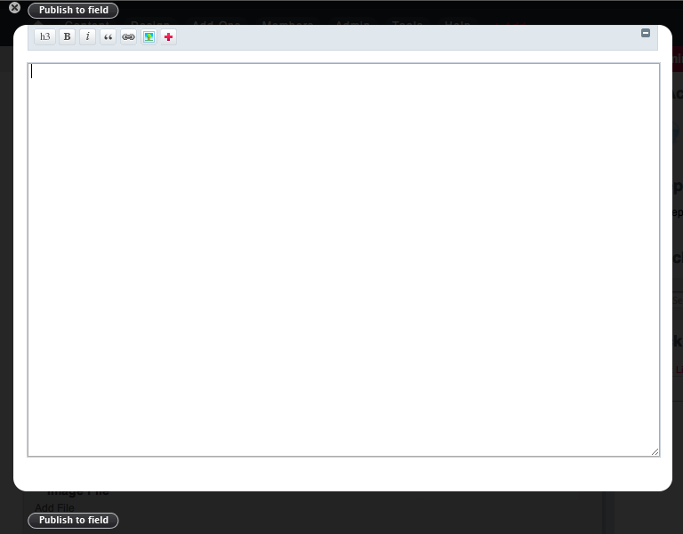
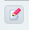
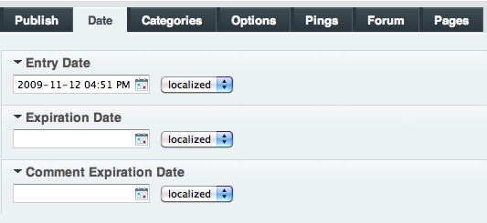
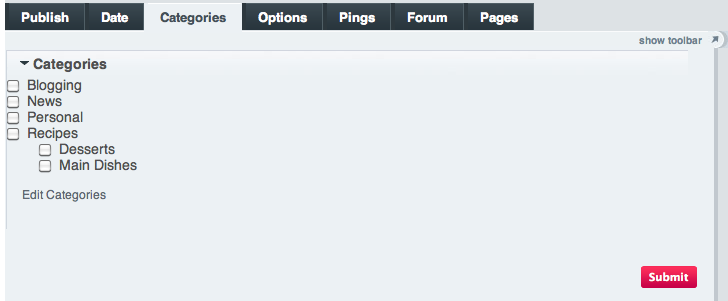
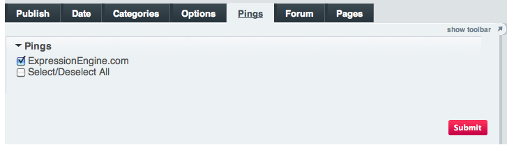
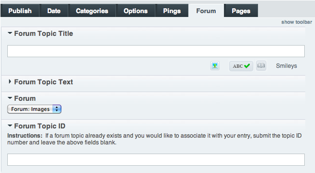
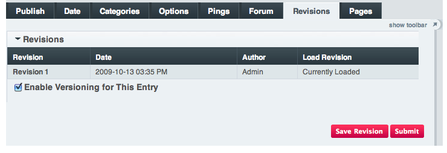
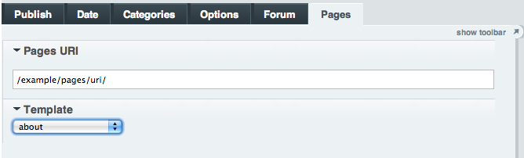

Publish Page
============

The main interface for creating content for your site
**Tip:** You can customize the display of the Publish Page by clicking
Show Toolbar and creating a custom `Publish Page
Layout <publish_page_layouts.html>`_.

The PUBLISH section of the Control Panel is where you will add entries
to your channels/site sections.

If you have more than one channel, when you move your cursor over the
PUBLISH tab you will see a menu listing your channels.

Once a channel is selected, you will see the main Publish screen where
you can create your entry.

Publish Page Areas
------------------

The *PUBLISH* page interface is broken into the following separate
"tabs":

Publish Form Tab
----------------

|Publish Form|
Title Field
~~~~~~~~~~~

This field contains the title of your channel entry. Titles can be up to
100 characters in length.

URL Title
~~~~~~~~~

Here you can define a "human readable" URL title for your entry. URL
titles may only contain alpha-numeric characters and no spaces. The
purpose of a URL Title is to enable your entries to be accessed using a
URL such as::

	http://example.com/index.php/channel/comments/joes_first_entry/

If you do not specify a "URL Title" one will automatically be created
for you based upon your entry Title. URL Titles must be unique within a
channel, so if an entry with the same title already exists then the URL
Title will have a number appended to the end to make it unique.

**Note:** If you let the system create your URL Title for you it will
convert spaces into underscores by default. For example, if the title of
your entry is "Joe's First Entry" it will be converted to
"joes\_first\_entry". If you prefer dashes to be used instead of
underscores (there is some evidence that Google prefers URLs with
dashes) you can change it in the following Control Panel page:

Admin > Channel Administration > Global Channel Preferences

Formatting Buttons
~~~~~~~~~~~~~~~~~~

If the user accessing the Publish page has any HTML Formatting Buttons
specified in their My Account page they will be displayed for use with
the entry fields. Each user is allowed their own formatting buttons,
which can be specified at:

My Account > Channel Settings > HTML Formatting Buttons

Entry Fields
~~~~~~~~~~~~

The names and types of entry fields displayed will be determined by what
`Channel Fields <../admin/content_admin/custom_channel_fields.html>`_
you have defined for this channel. If an entry field is set to be
"hidden" by default, it will have to be expanded by clicking on the
field name before content can be entered. In addition to the field
itself, you can also choose the type of `text
formatting <../../general/text_formatting.html>`_ to apply to that
field. You'll also notice "Check Spelling", "Glossary", and "Smileys"
options beneath each field.

Write Mode
~~~~~~~~~~

|Write Mode|
Write Mode allows for full-screen content editing. Write Mode is
initiated by clicking on the Pencil Icon:

|Write Mode Icon|
When you finish editing content in Write Mode, don't forget to click
"Publish to Field" to send your content back to the Publish Page.

Save Revision
~~~~~~~~~~~~~

Allows the content editor to force a revision save.

Submit
~~~~~~

The Submit button allows you to save the entry and publish it to your
site.

Date Tab
--------

|Publish Calendar|
Entry Date
~~~~~~~~~~

The entry date is the primary date associated with an entry. You may use
the interactive calendar to set the date/time. If you specify a date in
the future, ExpressionEngine will not display the entry on your site
until the date has arrived. This behavior can be overruled if you
instruct ExpressionEngine to include "future dates" in the Channel Tags
in your Templates.

Expiration Date
~~~~~~~~~~~~~~~

You may *optionally* specify an expiration date for the entry, causing
the system to no longer show the entry anywhere on your website after
that date. You may also use an interactive calendar to set the
date/time.

Comment Expiration Date
~~~~~~~~~~~~~~~~~~~~~~~

You may *optionally* specify a date on which comments for this entry
will no longer be accepted. Once the date passes, the entry will act as
though the Allow Comments checkbox (see below) is unchecked. You may
also use an interactive calendar to set the date/time.

Categories Tab
--------------

|Publish Categories|
You may assign your entries to one ore more categories. To select more
than one category you will typically hold down the CTRL (or CMD) key
while choosing the individual category names.

Clicking the Edit Categories link will permit you to add, edit, or
delete categories that appear in the list.

Options Tab
-----------

|Publish Options Tab|
Author
~~~~~~

You may select the author for this entry from the drop-down list. By
default only the person submitting the entry is shown in the author
list. If you would like to enable other authors so that the author name
can be changed please see this `troubleshooting
page <../../troubleshooting/channels_and_entries/new_members_not_authors.html>`_
for information.

Channel
~~~~~~~

This option is only available when *editing* an entry.

This drop-down list will contain all channels that share the same Field
Group, Category Group, and Status Group with the current channel for the
entry. Using this option, you can move an entry from one channel to
another channel that is set up similarly.

Status
~~~~~~

There are two primary statuses that are always available: Open and
Closed. Typically, "open" entries are viewable at your site, and
"closed" entries are not. You can add additional statuses for editorial
workflow in your `Statuses <../admin/content_admin/statuses.html>`_
page, and opt to display or suppress entries assigned to these by
modifying the "status" parameter found in the various "Channel" Tags in
your Templates.

Make Entry Sticky
~~~~~~~~~~~~~~~~~

If this option is checked, then the entry will be "stuck" at the top of
the list when displaying multiple entries. This can be useful for things
like announcement posts.

Allow Comments
~~~~~~~~~~~~~~

If this option is checked, then comments will be allowed for this entry.
When this option is unchecked, your comment submission form will be
suppressed. Any existing comments will still appear.

Pings Tab
---------

The ping tab allows you to send "pings" to the Ping Servers you have
defined in your My Account > Ping Servers area.

|Publish Pings Tab|
Forum Tab
---------

**Note:** This tab will only appear if you have the Discussion Forum
Module installed.

|Publish Forum|
The Forum tab allows you to optionally publish a forum topic to be
associated with the channel entry. You can then automatically link to
the created forum topic from within your {exp:channel:entries} tag using
the
`{forum\_topic\_id} <../../modules/channel/variables.html#var_forum_topic_id>`_
variable.

Forum Topic Title
~~~~~~~~~~~~~~~~~

You may specify the title to use for the new thread in the forum.

Forum Topic Text
~~~~~~~~~~~~~~~~

This is the main text for the forum thread.

You may use {permalink} to link from the Forum Entry to the Channel
Entry. This variable is replaced by the URL set in the "Comment Page
URL" preference under Admin > Channel Management. The URL Title of the
entry will be automatically added. For example, this::

	             <a href="{permalink}">my entry</a>

Would be rendered like this::

	             <a href="http://example.com/index.php/channel/comments/ice_cream/">my entry</a>

Forum
~~~~~

Here you choose in which forum the new thread should be added.

Forum Topic ID
~~~~~~~~~~~~~~

Instead of the previous settings, you may instead specify the ID for an
existing forum topic. This is useful if the forum topic already exists,
or if you want it to have a Poll or other special features.

This is an "either/or" type situation. You may either have a forum
thread created for you by specifying the title, text, and forum **or**
you may associate the entry with an existing ID.

Revisions Tab
-------------

**Note:** This tab will only appear if you have Entry Versioning enabled
at:
Admin > Channel Administration > Channel Management

|Publish Revisions Tab|
When Entry Versioning is enabled, every time you save changes to your
entries they will be saved so you can go back in time and retrieve older
versions of your entries. The Revisions Tab will show a list of all
revisions for the entry being edited

When a previous revision is selected it will be loaded into the Publish
page form so you can view or further edit it. If you save your changes,
a new revision will be created rather than updating the previous
revision. In other words, every time you click the save button a new
revision is stored.

Pages Tab
---------

**Note:** This tab will only appear if you have the `Pages
Module <../../modules/pages/index.html>`_ installed.

|Publish Pages|
Pages URI
~~~~~~~~~

Here you can choose the URI that will be used to display this "page"
entry. Provide only the URI segments and not a full URL. Since this will
be used in the URL, only URL safe characters are allowed, i.e. low ASCII
alpha-numeric characters, underscore / dash separators, and periods.

**CORRECT:**

-  /company/roster/board/ceo/
-  /my\_stuff/list.html

**INCORRECT:**

-  http://example.com/index.php/company/roster/board/ceo/
-  /my\_stuff/über\_list.html

**Note:** Entries cannot share the same Page URI. Each "page" entry must
be given a unique URI so the system knows which entry to display when
the Page URI is requested.

Template
~~~~~~~~

Here you can choose which template to use to display this "page" entry
when the above URI is requested.

.. |Publish Form| image:: ../../images/publish_form.png

.. |Publish Options Tab| image:: ../../images/publish_options.png

