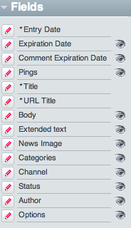
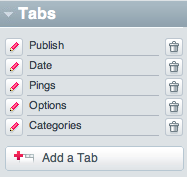
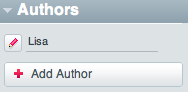
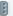
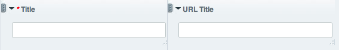
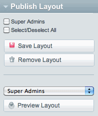

Publish Page Layouts
====================

Customizing Content Entry
The Publish/Edit page can be customized, with the layout saved per
member group, per channel. The Publish Page has a `default
layout <http://expressionengine.com/public_beta/docs/cp/content/publish.html>`_.

Show Toolbar
~~~~~~~~~~~~

Clicking Show Toolbar reveals the content entry areas that you can add,
remove, resize, and re-arrange for your custom layout.

Fields
^^^^^^

The Fields Grouping shows all available Channel Fields.

|Publish Page Fields|
The eye icon in the far right indicates whether that field is shown or
hidden on the publish page.

When the eye is open — |Publish Page Eye Open| — the field is shown.

When the eye is closed — |Publish Page Eye Closed| — the field is
hidden.

Required fields can not be hidden, so no eye is shown.

To add a field to the form, click and hold the field of choice, then
drag that field into the form and release.

**Tip:** You can drag the field directly to the name of the tab. Once
the tab is highlighted, release the field and the field will be added to
that tab in the Publish Form.

Tabs
~~~~

Tabs go across the top of the Publish Page and allow you to group
actions together.

|Publish Page Tabs Top|

You can add a new tab by clicking + Add a Tab at the top of the Publish
Page, or by clicking Add a Tab in the Tabs grouping in the Toolbar

|Publish Page Tabs|

This Tab Grouping includes the default tabs with the installation, as
well as those made since. You can delete a tab by clicking the Trash Can
— |Publish Page Trash| — to the right of each tab.

In some cases, you may need to localize the custom tab's name (for
example, on multi-lingual control panels). You may do so by first
entering as the tab's name the key you wish to use to represent that
tab's name. Next, you will need to manually add that key and its
corresponding value in the appropriate language file(s):
system/expressionengine/language/{language
name}/lang.publish\_tabs\_custom.php. It is recommended that you ensure
your language key is unique by namespacing it as in the following
example::

	  "eeof_example" => 'Example Tag!',

The language key eeof\_example would go in as the tab name, and Example
Tag! would show on the publish tab after the layout has been saved.

Authors
~~~~~~~

**Version difference:** As of version 2.1.1 the authors section is no
longer present because they are not directly tied to custom layouts.
Layouts are saved by member groups, see below.

You can add and remove authors while customizing the Publish Page
Layout.

|Publish Page Authors|

Arranging Fields
~~~~~~~~~~~~~~~~

Fields can be arranged and re-sized in the content area of the Publish
Form while the Toolbar is open.

To drag a field, use the mouse to grab the handle-bar — |Publish Page
Handle| — and drag it to the desired location.

To resize a field, use the mouse to grab the lower right corner of the
field — |Publish Page Resize Field| —and drag to the desired width.

**Tip:** Fields can be made to sit side-by-side by first resizing each
and then dragging them next to each other.

|Publish Page Example Side By Side|

Saving your Publish Page Layout
~~~~~~~~~~~~~~~~~~~~~~~~~~~~~~~

Publish Page Layouts can be previewed, saved, and removed per member
group.

|Publish Page Save Layout|

The next time a member of that group Publishes or Edits an entry in that
Channel, this custom publish page layout will be displayed.

.. |Publish Page Trash| image:: ../../images/publish_page_trash.png

