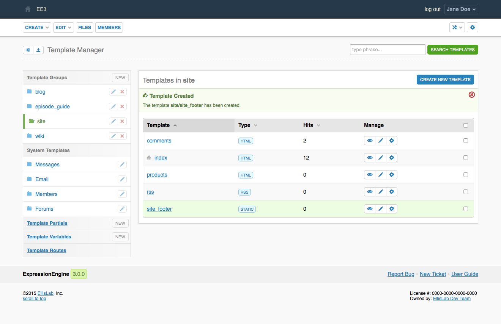

Template Manager
================

.. rst-class:: cp-path

**Control Panel Location:** :menuselection:`Developer Tools --> Template Manager`

.. Overview

The Template Manager allows you to create, edit and delete Template Groups
and Templates. Clicking a particular Template Group name will reveal that Group
so that you can work with it.

.. Permissions

Permission Restrictions
-----------------------

* Access settings: Design & Content
* Template groups: Create New Groups
* Template groups: Edit Groups
* Template groups: Delete Groups
* Template Management Allowed actions: Manage Template Settings
* Template Management Allowed actions: Create New Templates
* Template Management Allowed actions: Edit Templates
* Template Management Allowed actions: Delete Templates
* Template Management Allowed template groups

Actions
-------

.. contents::
  :local:
  :depth: 1

.. Each Action

.. include:: /cp/design/header.rst

Sidebar
~~~~~~~

New Template Group
^^^^^^^^^^^^^^^^^^

This will allow you to :doc:`create a new template group <group/form>`.

Template Groups
^^^^^^^^^^^^^^^

Your template groups. Clicking a particular Template Group name will reveal
that Group so that you can work with it.

Edit Template Group
^^^^^^^^^^^^^^^^^^^

This will take you to the template group's :doc:`edit form <group/form>`.

Remove Template Group
^^^^^^^^^^^^^^^^^^^^^

Removing a template group will cause a confirmation modal to appear that will
summarize the action.

Messages
^^^^^^^^

This will take you to the :doc:`system/index`.

Email
^^^^^

This will take you to the :doc:`email/index`.

Members
^^^^^^^

This will take you to the :doc:`members/index`.

Forums
^^^^^^

This will take you to the :doc:`forums/index`.

Template Partials
^^^^^^^^^^^^^^^^^

This will take you to the :doc:`snippets/index`.

New Template Partial
^^^^^^^^^^^^^^^^^^^^

This will allow you to :doc:`create a new temlate partial <snippets/form>`.

Template Variables
^^^^^^^^^^^^^^^^^^

This will take you to the :doc:`variables/index`.

New Template Variable
^^^^^^^^^^^^^^^^^^^^^

This will allow you to :doc:`create a new template variable <variables/form>`.

Template Routes
^^^^^^^^^^^^^^^

This will take you to the :doc:`routes`.

Create New Template
~~~~~~~~~~~~~~~~~~~

This will take you to the :doc:`create form <template/form>`.

Template Links
~~~~~~~~~~~~~~

This will take you to the template's :doc:`edit form <template/form>`.

Manage
~~~~~~

The icons in the manage column perform actions on the channel in its row.

View
^^^^

This opens the selected template in a new window, displaying it as it will be
rendered on your site.

Edit
^^^^

This will take you to the template's :doc:`edit form <template/form>`.

Settings
^^^^^^^^

This will open a modal with the template's settings form.

Bulk Actions
~~~~~~~~~~~~

The checkbox in the right-most column of the table selects a button for a bulk
action. When at least one checkbox is checked the bulk action dropdown menu and
submit button will be made available in the lower righthand corner of the table.

Remove
^^^^^^

The selected templates will be removed. Removing a template will cause a
confirmation modal to appear that will summarize the action.

Export Templates
^^^^^^^^^^^^^^^^

The selected templates will be zipped and downloaded.

.. toctree::
  :glob:
  :hidden:
  :titlesonly:

  *
  */index
