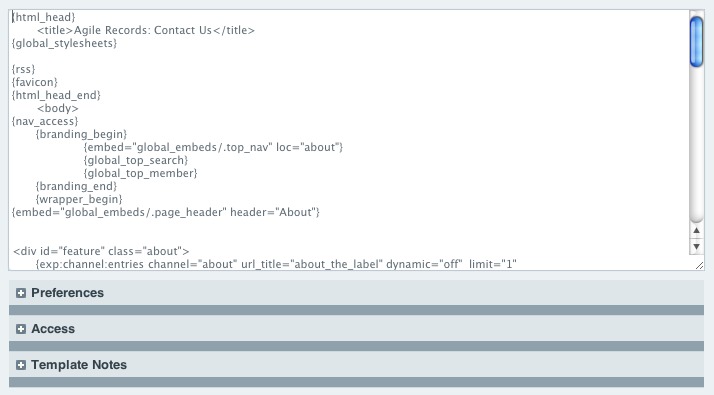

Template Editor
===============

|Template Edit|

Main Editing Area
~~~~~~~~~~~~~~~~~

The large form field in this page enables you to edit a Template.

View Rendered Template
~~~~~~~~~~~~~~~~~~~~~~

The View Rendered Template tab at the top of the page allows you to see
what your template looks like rendered in your web browser.

.. note:: Some templates will not render properly unless the URL
   contains certain information. For example, a typical comment page
   requires that the URL contain the ID of a specific entry. If some of
   the dynamic aspects are missing from your template when you view it
   it's likely because the URL doesn't contain information that is
   present when your template is viewed via your site.

.. _template-save-revision:

Save Revision
~~~~~~~~~~~~~

If you have enabled the Template Versioning feature you'll see a
checkbox that lets you choose whether to save a revision of your
template. You can then look at any past revisions using the View
Revision History pull-down menu at the top of the template. Enable
Template Versioning in your Control Panel under :menuselection:`Design
--> Templates --> Global Preferences`.

Preferences
~~~~~~~~~~~

|Template Preferences|
The Template Preferences section allows you to edit the preferences for
the currently viewed template.

Template Name
~~~~~~~~~~~~~

Template names may only contain alpha-numberic characters and no spaces.
Since template names are typically used as part of a URL they must
follow the standard URL naming rules.

.. note:: The "index" template can not be renamed. Each template group
   must have an index template.

.. _template-type:

Type
~~~~

This option allows you to specify the type of Template. Doing so will
enable ExpressionEngine to send the correct server headers and
appropriately tailor the output processing.

-  **Webpage**: This is the most common type of Template. Unless you
   specifically need one of the other two types you should use this one.
-  **CSS**: This type is used for Stylesheets. It tells
   ExpressionEngine to send "text/css" MIME type server headers.

   .. note:: CSS types are not processed using the main template parser
      in ExpressionEngine, making them much more light-weight than
      standard templates.

-  **RSS Page**: Used for RSS and Atom syndication feeds. It tells
   ExpressionEngine to send "text/xml" MIME type server headers when
   being viewed.
-  **JavaScript**: Used for outputting JavaScript code. It tells
   ExpressionEngine to send "text/javascript" MIME type server headers
   when being viewed.
-  **Static**: Used for static content with absolutely no
   ExpressionEngine rendered tags. Useful for HTML design elements
   embedded in other templates.

Enable Caching
~~~~~~~~~~~~~~

This determines whether or not Template Caching is enabled for the
Template. This is used together with the following preference.

Refresh Interval
~~~~~~~~~~~~~~~~

If the previous preference is enabled, then this specifies how long (in
minutes) the Template cache should active. The next time the Template is
requested after the time interval has expired, a new cache will be
created.

Allow PHP?
~~~~~~~~~~

Here you specify whether or not the Template will parse PHP expressions.
If the preference is set to "no", then any PHP in the Template will be
output as plain text.

PHP Parsing Stage
~~~~~~~~~~~~~~~~~

If the previous preference is enabled, this sets whether PHP is parsed
on "input" or "output" in the Template. See :doc:`Using PHP in
Templates </templates/php>` for more
information.

Hit Counter
~~~~~~~~~~~

If you wish to manually revise the hit counter for a Template you may do
so.

Template Size
~~~~~~~~~~~~~

The Template Size field allows you to change the size of the main
editing form in this page. The change you make will be applied globally
to all templates, but **only** for your particular membership account.
Each member of your site that has Template editing privileges can set
their own Template Size so that the editing field fits the size of their
particular computer monitor and web browser.

Protect JavaScript
~~~~~~~~~~~~~~~~~~

Heavily compressed JavaScript can sometimes look like valid template
tags (e.g. ``{if ...}``). When this setting is enabled, the template
parser will not attempt any conditional parsing inside ``<script>``
tags. If there is no JavaScript in this template, or the JavaScript is
not compressed, then you do not need to worry about this setting.

Access
~~~~~~

|Template Access|
the Access tab enables you to set template access permissions.

The Preferences tab enables you to set the templates name, type,
caching, parsing, hit counter, and size preferences.

Template Notes
~~~~~~~~~~~~~~

The Template Notes tab enables you to save notes and information about
your template. This information is available only in this page.

Template Syntax Warnings
~~~~~~~~~~~~~~~~~~~~~~~~

As you write your template, ExpressionEngine looks for modules and
plugins that are either not installed or do not exist. In the event that
matches are found it will indicate these with a red dotted underline.

.. |Template Preferences| image:: ../../../images/template_preferences.png
.. |Template Access| image:: ../../../images/template_access.png
