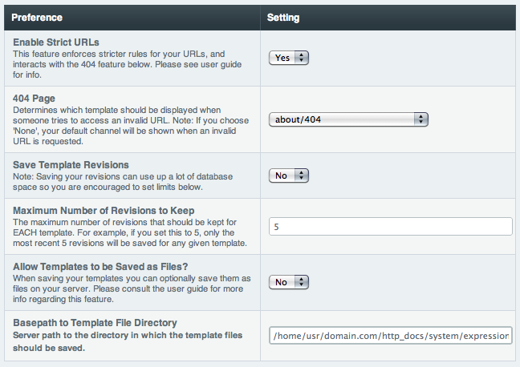

Global Template Preferences
===========================

.. rst-class:: cp-path

**Control Panel Location:** :menuselection:`Design --> Templates --> Template Preferences`

This section of the Control Panel allows you to define global
preferences which affect all Templates.

|Global Template Preferences|

.. _strict_url_label:

Strict URLs
~~~~~~~~~~~

This setting determines whether or not ExpressionEngine allows Templates
from your default Template Group to be directly accessed in the first
URL segment. Enabling Strict URLs requires that the first URL segment be
a valid Template Group only, or a 404 page is shown.

If you wish to extend this to the second segment, requiring a valid
template, then in your "index" template of your Template Group(s) that
you wish to do this, you can take advantage of the :ref:`{redirect=} global
variable <global_redirect>` like so::

	{if segment_2 != ''}   {redirect="404"} {/if}

Our official recommendation is that users **enable** Strict URLs, as
doing so makes the path to your content more precise, allows more
relevant 404 pages, and does not allow your content to be shown with
variances in the URL structure. However, for legacy reasons, Strict URLs
are disabled by default.

.. _global-template-404-label:

404 Page
~~~~~~~~

This determines which template should be displayed when someone tries to
access an invalid URL. If you choose "None", a standard 404 message and
server header will be shown.

Please note that ExpressionEngine **only** validates the first two
segments of your URLs when determining whether to show a 404 page, since
these segments will correlate to a Template Group and Template name
(which represent your site's "pages"). Anything beyond the first two
segments can not be used to show a 404 page (with one notable exception,
using the :ref:`channel_entries_require_entry` parameter).

For an explanation regarding how ExpressionEngine interprets your URLs,
please see :doc:`/urls/url_structure` page.

.. _global-template-save-templates-revisions-label:

Save Template Revisions
~~~~~~~~~~~~~~~~~~~~~~~

If this preference is set to "Yes", then any changes you make to one of
your :doc:`Templates <edit_template>` will be saved. This allows you to
keep a record of all changes made so that you can easily revert back to
an earlier version of a Template if you need to do so.

.. _global-template-max-revisions-label:

Maximum Number of Revisions to Keep
~~~~~~~~~~~~~~~~~~~~~~~~~~~~~~~~~~~

The maximum number of revisions that should be kept for **each**
template. For example, if you set this to 5, only the most recent 5
revisions will be saved for any given template. This setting helps
ensure that your database does not get too large due to storing Template
revisions.

.. _global-template-save-templates-as-files-label:

Save templates as files
~~~~~~~~~~~~~~~~~~~~~~~

This determines whether your Templates are saved to files
in addition to the datbase, allowing easy editing via the
editor of your choice. See :doc:`/templates/templates_as_files` for
more information.

Server path to site's templates
~~~~~~~~~~~~~~~~~~~~~~~~~~~~~~~

This is the *server path* (not URL) to the folder that holds the
Template files. A server path often looks similar to::

	/home/usr/domain.com/system/expressionengine/templates/

Server paths will vary from server to server, so you should contact your
Host or server admin if you are unsure of what your setting should be.

See :doc:`/templates/templates_as_files` for more information.

