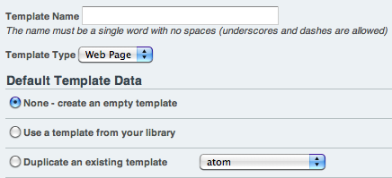

New Template
============

The New Template link in the left column of each Template Group allows
you to create a new Template.

|Template New|
Template Name
~~~~~~~~~~~~~

The name of the Template. This must be a single word with no spaces. You
may use the letters a-z, the numbers 0-9, and the underscore and
hyphen/dash characters. You should refrain from creating all-numeric
Template names as they can cause confusion with Entry IDs used in URLs.

Template Type
~~~~~~~~~~~~~

Here you may specify the type of Template:

-  **Webpage**: This is the most common type of Template. Unless you
   specifically need one of the other two types you should use this one.
-  **CSS Stylesheet**: This type is used for Stylesheets. It tells
   ExpressionEngine to serve the Template as "text/css" MIME type.
   Further, the Template will *not* be parsed for EE Tags like normal.
   The Template is served "as-is".
-  **RSS Page**: Used for RSS and Atom syndication feeds. It tells
   ExpressionEngine to serve the Template as "text/xml" MIME type.
-  **JavaScript**: Used for outputting JavaScript code. It tells
   ExpressionEngine to send "text/javascript" MIME type server headers
   when being viewed.
-  **Static**: Used for static content with absolutely no
   ExpressionEngine rendered tags. Useful for HTML design elements
   embedded in other templates.
-  **XML**: Used for outputting XML pages with EE. It tells
   ExpressionEngine to send "text/xml" MIME type server headers when
   being viewed.

Default Template Data
~~~~~~~~~~~~~~~~~~~~~

You may specify whether the Template should be populated with default
data upon creation:

-  **None - create an empty template:** This creates a blank Template.
-  **Duplicate an existing template:** You may choose one of your
   existing Templates to duplicate its contents. The options are listed
   by Template\_Group/Template.

