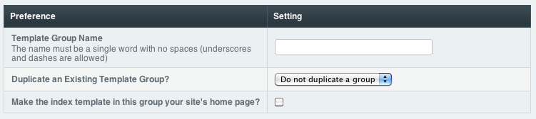

Create Template Group
=====================

The New Template Group tab at the top of the Templates page allows you
to create a new Template Group.

|Template New Group|

Template Group Name
~~~~~~~~~~~~~~~~~~~

The name of the Template Group. This must be a single word with no
spaces. You may use the letters a-z, the numbers 0-9, and the underscore
and hyphen/dash characters. You should refrain from creating all-numeric
Template Group names as they can cause confusion with Entry IDs used in
URLs.

Duplicate an Existing Template Group
~~~~~~~~~~~~~~~~~~~~~~~~~~~~~~~~~~~~

You can optionally choose to base your new group on an existing one.

Default Home Page
~~~~~~~~~~~~~~~~~

ExpressionEngine requires that the "index" template in one of your
template groups be considered your site default page. This page will be
shown if **only** the Template Group is specified in the URL. For
example::

	http://example.com/index.php/template_group/

The checkbox at the bottom of the Template Group page allows you to
choose a particular Group as the site default.

