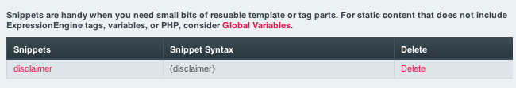

Snippets
========

.. rst-class:: cp-path

**Control Panel Location:** :menuselection:`Design --> Templates --> Snippets`

In this section of the Design area, you can create and edit
:doc:`Snippets </templates/globals/snippets>`.

|Design Snippets|

Snippets can contain *any content*, including ExpressionEngine tags and
even PHP. For this reason, Snippets can only be edited by those with
Template Administration privileges.

.. note:: Snippets are not able to nested inside of other snippets.

