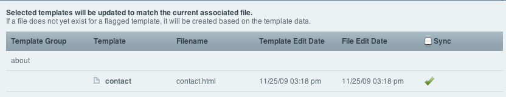

Synchronize Templates
=====================

Control Panel Location: Templates > Synchronize Templates
This section of the Control Panel allows you to synchronize templates
stored in the database with their text file counterparts. In order to
use this feature you must first set your site up to `Save Templates as
Text Files <../../../templates/flat_file_templates.html>`_.

Synchronizing Templates with Text Files
---------------------------------------

|Template Synchronize|
Upon loading the page, any files in the designated template directory
that meet the requirements will have associated templates created for
them. All templates set to 'save files as templates' will be shown in
the file synchronization interface. Three 'types' of template-file
pairings may be indicated:

-  Synced files. No action is needed. The datebase update is more recent
   than the associated file and is thus 'in sync'.
-  Outdated template. The file associated with the template is more
   recent than the copy in the database. The information in the database
   is outdated, and you may wish to select the template for syncing.
-  File does not exist. While rare, it is possible to have a template
   flagged to 'save templates as text files' and no associated file.
   Though a file would be created the next time you save the template in
   the template editor, you may choose to use the synchronization form
   to create multiple files in one step.

