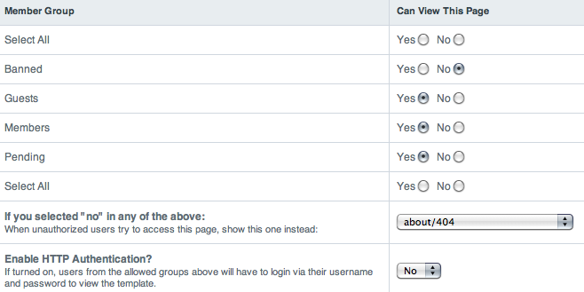
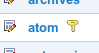

Template Access Restriction
===========================

|Template Access|
Member Group
~~~~~~~~~~~~

The member group(s) to which the Access restrictions will apply.

Can View this Page?
~~~~~~~~~~~~~~~~~~~

This determines whether or not this member group is allowed to view this
template.

Unauthorized access redirect
~~~~~~~~~~~~~~~~~~~~~~~~~~~~

When a member of an unauthorized member group attempts to access the
template, they will be redirected to the template selected from the
drop-down menu.

HTTP Authentication
~~~~~~~~~~~~~~~~~~~

If this setting is enabled, users will be prompted to login with their
username and password to view the template using a standard HTTP
Authentication dialog box. An example usage of this would be to protect
an RSS/Atom feed from being viewed by unauthorized users, but still be
compatible with Feed Readers that support HTTP Authentication, allowing
authorized members to retrieve the feed.

If you have HTTP Authentication enabled, a small key icon will appear
next to the template's name in the Template Manager.

|HTTP Authentication symbol example|

.. note:: If the login fails, the user will receive a 401 Not Authorized
	page, and not the redirect template specified in the above drop-down
	menu. Additionally, this ability is typically only available when
	PHP is run as an Apache module.

**SECURITY NOTE:** Do to the nature of HTTP Authentication, if used, the
username and password submitted might be sent in the clear (unencrypted)
and thus could be viewable by someone snooping in on your network. For
this reason, we strongly encourage you to follow good safety practices
with this feature. Trust your network (no open wifi networks), never use
a SuperAdmin login, and if possible have SSL (https://) used on these
pages or your site as it will encrypt your requests and protect the
information sent.

