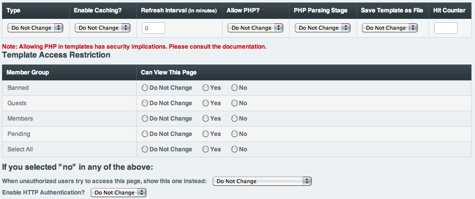

Template Preferences
====================

.. rst-class:: cp-path

**Control Panel Location:** :menuselection:`Design --> Templates --> Template Preferences`

This page allows you to modify the preference and access settings for
multiple templates at once.

Choose Templates
----------------

The first section allows you to choose
the templates you wish to modify. Remember that if you click on a
multiple select list, you can use CTRL-A to select all in Windows and
Command-A to select all on Macs.

|Template Prefs Manager|

Modify Preferences and Access
-----------------------------

Simply change the preferences and access details for the templates
you've selected and leave all other options set to "Do Not Change".
Click on Update to apply your changes to the selected templates.

|Template Prefs Manage Prefs|

.. note:: With the Template Access Restrictions, if you select Do Not
   Change for a group and it is already not allowed to view a template it
   will remain so. If it can view a template, that will remain as well. In
   this way, templates with different combinations of groups access can all
   be modified to allow or disallow a particular group.

.. |Template Prefs Manager| image:: ../../../images/template_prefs_manager.png

