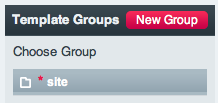

Template Manager
================

.. rst-class:: cp-path

**Control Panel Location:** :menuselection:`Design --> Templates --> Template Manager`

The Template Manager allows you to create, edit and delete Template Groups
and Templates. Clicking a particular Template Group name will reveal that Group
so that you can work with it.

.. tip:: You can select multiple Group names to show more than one.

|Template Group Select|

Once chosen, the Template Group will be shown.

|Template Group|

Left Column
~~~~~~~~~~~

On the left side you'll find the Template Group as well as template
export options.

-  **Export Templates**: Allows you to export Templates as a zip files
   with the directory structure of templates `saved as 
   files </templates/templates_as_files>`.

Header Navigation
~~~~~~~~~~~~~~~~~

In the header navigation you'll find the Template Group and several
links:

-  :doc:`New Template <new_template>`: Allows you to add a new
   Template to the Template Group.
-  **Edit Group**: Allows you to edit the name of the Template Group.
-  **Delete Group**: Allows you to delete an entire Template Group and
   all Templates within it.

Right Column
~~~~~~~~~~~~

The right side you'll see a list of all the Templates that are part of
the Group. There are several columns in the table:

-  :doc:`Template Name (Edit Template) <edit_template>`: Clicking
   the name allows you to edit the Template.
-  **Hits**: The number of times the Template has been viewed or "hit"
   on your site.
-  **View**: This opens the selected Template in a new window,
   displaying it as it will be rendered on your site.
-  :doc:`Access <template_access>`: Allows you to restrict the
   viewing of your templates based on Member Groups.
-  **Delete**: Allows you to delete the Template.

Other Controls
--------------

There are also a few other controls at the top of the Templates page:

-  :doc:`New Template Group <new_template_group>`: Allows you to
   create additional Template Groups.
-  :doc:`Global Variables <global_variables>`: Allows you to create
   your own custom variables.
-  :doc:`Global Template
   Preferences <global_template_preferences>`: Master
   preferences that affect all templates/groups.
-  **Edit Group Order**: Permits you to rearrange the order that groups
   appear in the list.
-  :doc:`Template Preferences
   Manager <template_preferences_manager>`: Manage Preferences
   and Access for Multiple Templates and Groups at once.

.. |Template Group| image:: ../../../images/template_group.png
