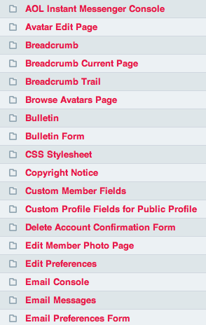

Member Profile Templates
========================

.. rst-class:: cp-path

**Control Panel Location:** :menuselection:`Design --> Themes --> Member Profile Templates`

The *Member Profile Templates* area of the Control Panel permits you to
edit any of the templates used to generate the member
profile area and registration page of your site.

.. note:: The member profile templates are stored as text files on your
   server at the following location::

	themes/profile_themes/

By default ExpressionEngine uses its default set of templates, but you
may make a copy of this folder and use it instead. You may also select
your new set of templates to be the site default in your
:doc:`/cp/members/membership_preferences` page. If you have multiple
sets of templates your members will be able to choose which one to use
in their profile area.

|Member Templates|

