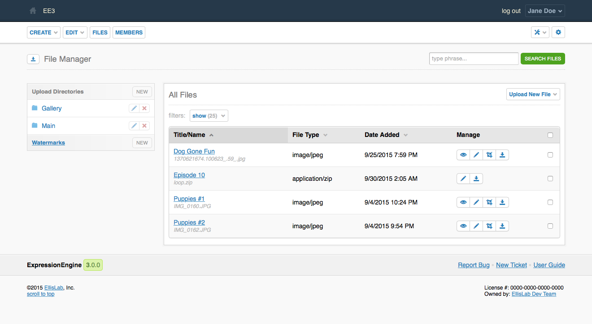

.. # This source file is part of the open source project
   # ExpressionEngine User Guide (https://github.com/ExpressionEngine/ExpressionEngine-User-Guide)
   #
   # @link      https://expressionengine.com/
   # @copyright Copyright (c) 2003-2019, EllisLab Corp. (https://ellislab.com)
   # @license   https://expressionengine.com/license Licensed under Apache License, Version 2.0

File Manager
============

.. rst-class:: cp-path

**Control Panel Location:** :menuselection:`Files`

.. Overview

On the main File Manager page you can view all of your previously uploaded
files. Files can be searched by keyword as well as filtered by upload location.
You can also select multiple files using the checkboxes on the right, and then
download the files or delete them using the dropdown menu at the bottom of the
page.

.. Screenshot (optional)

.. Permissions

Permission Restrictions
-----------------------

* File upload directories: Create Upload Directories
* File upload directories: Edit Upload Directories
* File upload directories: Delete Upload Directories
* Files: Upload New Files
* Files: Edit Files
* Files: Delete Files

Actions
-------

.. contents::
  :local:
  :depth: 1

.. Each Action

.. include:: /cp/files/_header.rst

Sidebar
~~~~~~~

New Upload Directory
^^^^^^^^^^^^^^^^^^^^

This will take you to the :doc:`upload directory create form <uploads/form>`.

Upload Directory Links
^^^^^^^^^^^^^^^^^^^^^^

This will filter the display to the indicated directory.

Edit Upload Directory
^^^^^^^^^^^^^^^^^^^^^

This will take you to the :doc:`upload directory edit form <uploads/form>`.

Remove Upload Directory
^^^^^^^^^^^^^^^^^^^^^^^

This will remove the indicated directory. Removing a directory will cause a
confirmation modal to appear that will summarize the action.

Watermarks
^^^^^^^^^^

This will take you to :doc:`watermarks/index`.

New Watermark
^^^^^^^^^^^^^

This will take you to the :doc:`watermark create form <watermarks/form>`.

Sync
~~~~

This will take you to :doc:`uploads/sync`.

.. note:: This will only be available if you are viewing a single directory.

Upload New File
~~~~~~~~~~~~~~~

This will take you to the :doc:`upload form <upload>`.

Title/Name Link
~~~~~~~~~~~~~~~

This will take you to the file's :doc:`edit form <form>`.

Manage
~~~~~~

The icons in the manage column perform actions on the file in its row.

View
^^^^

This will open a modal displaying a preview of the image.

.. note:: This will only be available if the file is an image.

Edit
^^^^

This will take you to the file's :doc:`edit form <form>`.

Crop
^^^^

This will take you to the file's :doc:`crop form <crop>`.

.. note:: This will only be available if the file is an image.

Download
^^^^^^^^

Clicking this icon will download the file.

Bulk Actions
~~~~~~~~~~~~

The checkbox in the right-most column of the table selects a button for a bulk
action. When at least one checkbox is checked the bulk action dropdown menu and
submit button will be made available in the lower righthand corner of the table.

Remove
^^^^^^

The selected files will be removed. Removing a file will cause a
confirmation modal to appear that will summarize the action.

Download
^^^^^^^^

The selected files will be zipped and downloaded.

.. toctree::
  :glob:
  :hidden:
  :titlesonly:

  *
  uploads/*
  watermarks/index
