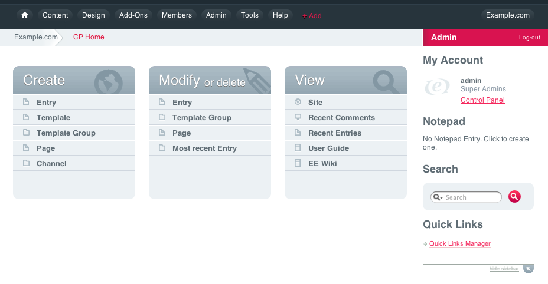

#################
The Control Panel
#################

Also known as the "back end," the Control Panel is where most of your interaction
with ExpressionEngine will take place. Here you’ll publish and edit your content,
control the look and feel of your site, manage your members and much more.

.. toctree::
	:titlesonly:
	:maxdepth: 1
	
	content/index
	design/index
	add-ons/index
	members/index
	admin/index
	tools/index
	my_account/index
	sites/index

