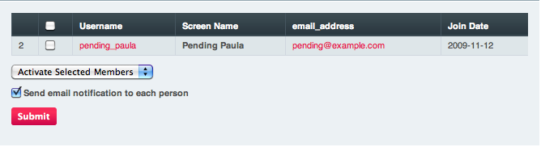

Activate Pending Members
========================

.. rst-class:: cp-path

**Control Panel Location:** :menuselection:`Members --> Activate Pending`

The Activate Pending Members section of the Control Panel allows you to
activate any members that have registered and are pending activation.

|Activate Members|

Why Are Members Pending?
~~~~~~~~~~~~~~~~~~~~~~~~

There are two circumstances under which a member might be considered
"pending":

#. The user has not activated their account by clicking the link in the
   "activation email" they were sent upon registering. Normally, when
   someone registers for a membership account, the system sends them an
   email containing a special link that must be clicked in order to
   activate their account. If they have not clicked the link their
   account will remain as *pending*, which means they won't be able to
   log-in or utilize member's only aspects of your site. You may disable
   "self-activation" or change it to "admin activation" at:
   Admin > Members and Groups > Membership Preferences

#. Your site requires Admin activation. You may optionally set up your
   membership system to require that an administrator manually review
   and activate membership accounts manually at:
   Admin > Members and Groups > Membership Preferences

Activate/Delete Selected Members
~~~~~~~~~~~~~~~~~~~~~~~~~~~~~~~~

The pull-down menu at the bottom of the activation page allows you to
either activate or delete members you have selected using the checkboxes
on the right. When a member is *activated* what you are really doing is
changing the Member Group they are assigned to. By default
ExpressionEngine uses the Members group for activation but you can set a
different group for this purpose at:

Admin > Members and Groups > Membership Preferences

Send Email Notification
~~~~~~~~~~~~~~~~~~~~~~~

The checkbox at the bottom of the page causes one of two emails to be
sent, informing the user of your decision, based on whether you are
activating or deleting the account. Each of the two emails is stored as
a template, which can be edited in the Specialty Templates area of the
Control Panel, located here:

Admin > Email Notification Templates > Email Notification Templates

The two templates are:

#. Member Account Validation Notification
#. Member Account Decline Notification

