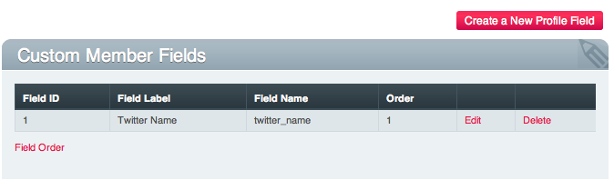

Member Fields
=============

Control Panel Location: Admin > Members and Groups > Custom Member
Fields
|Custom Member Fields Overview|
The *Member Fields* feature permits you to add fields to the member
registration form and/or member profile and My Account areas.

-  `Create a New Member Field <custom_member_fields_edit.html>`_: Allows
   you to create a new field.
-  `Edit <custom_member_fields_edit.html>`_: Edit an existing field
-  **Delete**: Delete the field.

